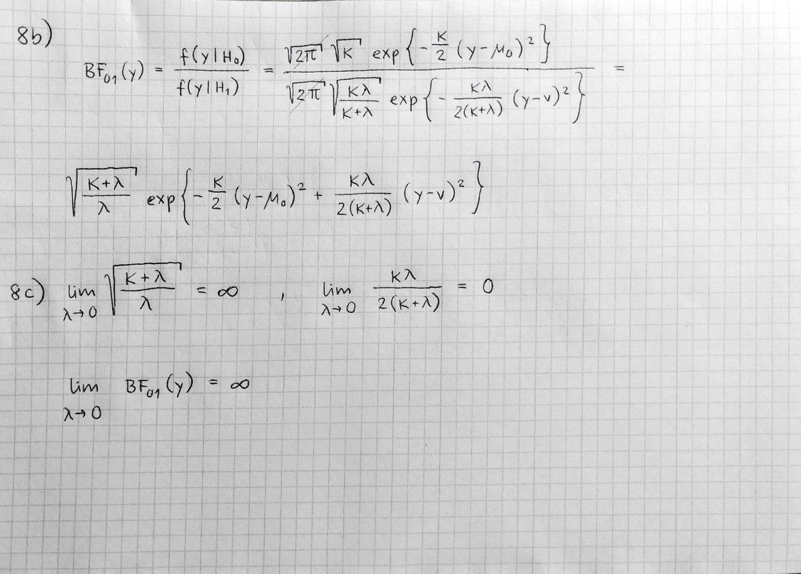
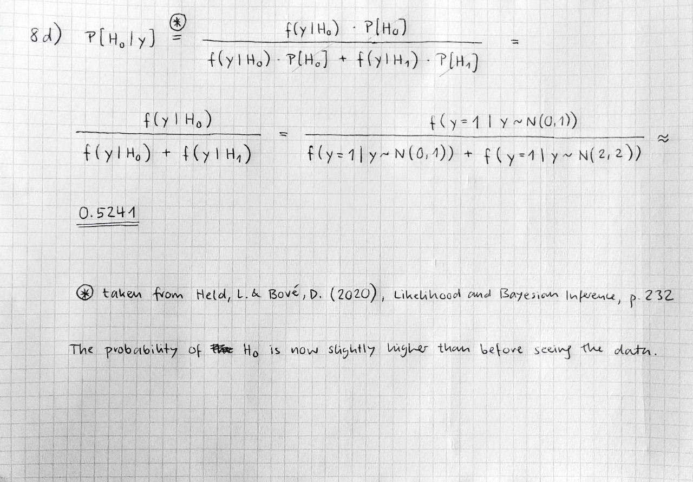

```{r setup, include=FALSE}
# Set chunk options here 

knitr::opts_chunk$set(echo = TRUE)
```

```{r}
library(tidyverse)
library(rjags)
library(coda)
library(bayesmeta)
library(pCalibrate)
```

# Exercise 5

Prove the conditional Bayes theorem:
$$
    P(A|B, I) = \frac{P(B|A, I)P(A|I)}{P(B|I)}
$$


## Proof
This is a conditional version of Bayes' theorem, were $I$ is an additional piece of information (see STA421 Script, Chapter 1). 
We start with the definition of conditional probability:
$$
\begin{equation}
    P(A|B, I) = \frac{P(A \cap B|I)}{P(B|I)}
\end{equation}
$$

We know that conditional probability also satisfies:
$$
\begin{equation}
    P(B|A, I) = \frac{P(A \cap B|I)}{P(A|I)}
\end{equation}
$$

Rearranging terms, we get:
$$
\begin{equation}
    P(A \cap B|I) = P(B|A, I) \cdot P(A|I)
\end{equation}
$$

Substituting back into our original equation, we get:
$$
\begin{equation}
    P(A|B, I) = \frac{P(B|A, I) \cdot P(A|I)}{P(B|I)}
\end{equation}
$$

This completes the proof of the conditional Bayes theorem. It shows how to update the probability of an event $A$ given the occurrence of another event $B$ and additional information $I$, using prior probabilities and the likelihood of $B$ given $A$ and $I$.

# Exercise 6

**Given:**

Diagnostic test with sensitivity P[T^+^|D^+^] = 0.95 and specificity P[T^-^|D^-^] = 0.94 
Disease prevalence P[D^+^] = 0.001

**Question:**

What is P[D^-^|T^+^]?

**Solution:**

Bayes: 
$$P[A|B] = \frac{P[B|A]*P[A]}{P[B]}$$

Therefore:
$$P[D^-|T^+] = \frac{P[T^+|D^-]*P[D^-]}{P[T^+]}$$
$$P[T^+]=P[T^+|D^+]*P[D^+]+P[T^+|D^-]*P[D^-]$$
$$P[T^+|D^-] = 1-P[T^-|D^-]$$
$$P[D^-] = 1-P[D^+]$$

R code for calculation:
```{r}
sens <- 0.95
spec <- 0.94
prev <- 0.001
pt <- sens*prev+(1-spec)*(1-prev)
(prob_dn_tp <- ((1-spec)*(1-prev))/pt)
```
The P[D^-^|T^+^] is 0.98. Therefore the probability that someone tested positive actually is healthy given a prevalence of the disease of 0.001 is very high due to the relatively low prevalence.

# Exercise 7

## Setup

```{r}
set.seed(44566)
mu <- 160
sigma <- 20
M <- 1000
X <- rnorm(M, mu, sigma)
```

## 1.

```{r}
glue::glue("True Values")
glue::glue("----")
glue::glue("mean: {mu}")
glue::glue("standard deviation: {sigma}")
glue::glue("variance: {sigma^2}")
glue::glue("median: {mu}")
glue::glue("0.025, 0.5 and 0.975 quantiles:")
qnorm(c(0.025, 0.5, 0.975), mu, sigma)
```

## 2.

```{r}
coda::traceplot(mcmc(X))
```

## 3.

```{r}
tibble(x = X) |> ggplot(aes(x = x)) + 
  geom_histogram(aes(y=after_stat(density)), bins = 30) + 
  stat_function(fun = dnorm, args = list(mu, sigma), color="blue", linewidth = 2) +
  labs(title = "Histogram of X", x = "X", y = "Frequency")
```
The distributions are close, but the Monte Carlo histogram looks slightly bimodal.

## 4.

```{r}
glue::glue("Estimated Values")
glue::glue("------")
glue::glue("mean: {mean(X)}")
glue::glue("standard deviation: {sd(X)}")
glue::glue("variance: {var(X)}")
glue::glue("median: {median(X)}")
glue::glue("0.025, 0.5 and 0.975 quantiles:")
{quantile(X, probs = c(0.025, 0.5, 0.975))}
```
The estimations are fairly close to the truth

## 5.

```{r}
glue::glue("Estimated P[X > 175]: {mean(X > 175)}")
glue::glue("True P[X > 175]: {pnorm(175, mu, sigma, lower.tail = FALSE)}")
glue::glue("")
glue::glue("Estimated P[150 < X < 180]: {mean(X > 150 & X < 180)}")
glue::glue("True P[150 < X < 180]: {pnorm(180, mu, sigma) - pnorm(150, mu, sigma)}")
```
The estimations are again pretty good

# Exercise 8

## b & c
{width=40% height=60%}

## d
{width=40% height=60%}


# Exercise 9

```{r, warning=FALSE, message=FALSE}
dat <- matrix(data = c(14, 9, 1, 5), ncol = 2, byrow = T)
bf <- twoby2Calibrate(dat, type = "two.sided", alternative = "simple")

formatBF(bf$minBF, digits = "default")
```

The bayes factor $\frac{1}{3.4} = 0.29$ is decreasing the prior odds of no effect P[H0].

```{r}
BF2pp(bf$minBF, prior.prob = 0.5)
```

The posterior probability P[H0|data] is estimated to be 0.23, meaning
the probability that H0 (prior probability of no effect = 0.5) is true given our data is estimated to be 0.23.


