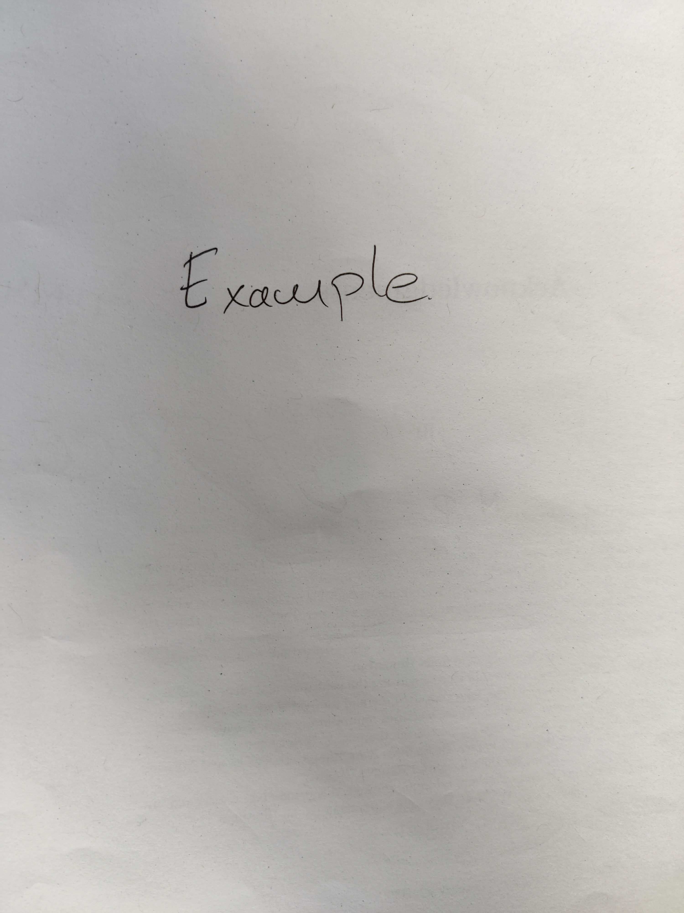

```{r setup, include=FALSE}
# Set chunk options here 

knitr::opts_chunk$set(echo = TRUE)
```

### Section 
## Subsection 
# Subsubsection 

```{r simple_r_code}
x <- rnorm(n = 100, mean = 0, sd = 1)
head(x)
```

How to insert a figure 

```{r how_to_figure, fig.width=10, fig.height=2, fig.fullwidth=TRUE, fig.cap="A nice image." }
hist(x)
```


```{r how_to_figure_2, out.width="50%", fig.cap="A nice image.\\label{fig:figs}" }
hist(x)
```

Refer to a figure like this: Figure~\ref{fig:figs}

How to insert a picture

{width=40% height=60%}

$$
\gamma \sim \beta_{max} \: \text{and some text} \dots
$$
