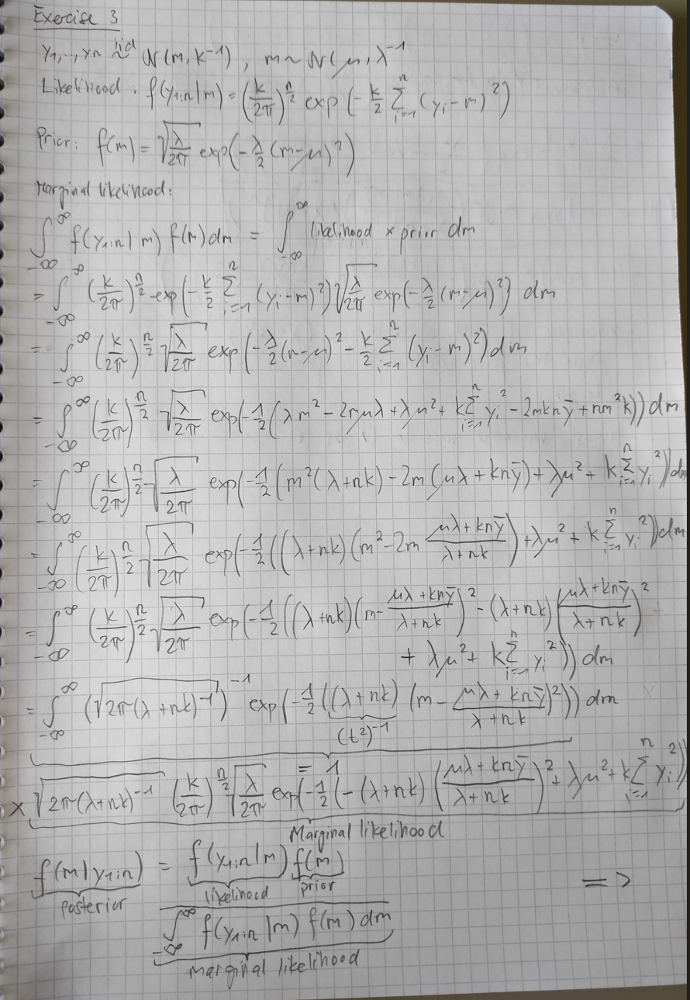
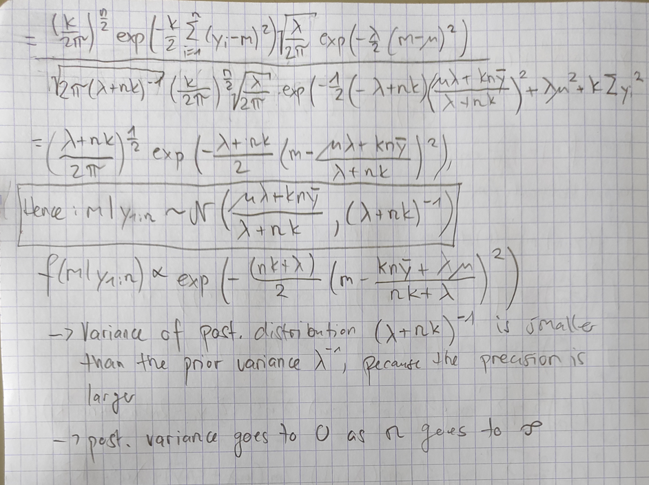

```{r setup, include=FALSE}
# Set chunk options here 

knitr::opts_chunk$set(echo = TRUE)
```

```{r, message = F}
library(tidyverse)
library(rjags)
library(coda)
library(bayesmeta)
library(pCalibrate)
library(glue)
```

# Exercise 3

See figures below  
{width=60% height=60%}  
{width=60% height=60%}


# Exercise 4

Per exercise 3:

$$
m|y_{1:n} \sim \mathcal{N}(\frac{kn\bar{y} + \lambda\mu}{kn + \lambda}, \frac{1}{kn + \lambda})
$$

```{r}
dat <- tibble(y = c(166, 168, 168, 177, 160, 170, 172, 159, 175, 164, 175, 167, 164))
k <- 1/900
u <- 161
l <- 1/70
```

## a)

```{r}
dat |> summary()
dat |> ggplot(aes(x = y)) +
  geom_histogram(binwidth = 1) +
  ggtitle("Histogram")
dat |> ggplot(aes(sample = y)) +
  stat_qq() +
  ggtitle("QQ-plot")
dat |> ggplot(aes(y = y)) +
  geom_boxplot() +
  ggtitle("Boxplot")
```

The QQ plot tells us that the data is probably normally distributed, the boxplot shows that there are no outliers.

```{r}
alpha <- 0.05 / 2 # two tailed
n <- length(dat$y)
mean <- mean(dat$y)
std_dev <- sd(dat$y)
std_err <- std_dev / sqrt(n)
t <- qt(1 - alpha, df = n - 1)
ci <- mean + c(-1, 1) * t * std_err
ci

# or, alternatively
confint(lm(y ~ 1, data = dat))
```

The correct frequentist interpretation of the confidence interval is tricky. Strictly, the 95% confidence interval says that if we were to sample from the same population many times and calculated the 95% confidence interval each time, 95% of these intervals would contain the true mean. The more commonly used interpretation is that the true mean is probably between 165 cm and 171 cm.

## b)

```{r}
std_dev <- 1/sqrt(l)

tibble(x = u + 30 * c(-1, 1)) |>
  ggplot(data = , aes(x)) +
  stat_function(fun = dnorm, n = 101, args = list(mean = u, sd = std_dev), linewidth = 2) + 
  labs(
    title = "Prior distribution",
    x = "m",
    y = "Density"
  )
```

```{r,results = "hold"}
glue::glue("Prior mean: {u} cm")
glue::glue("Prior standard deviation: {std_dev} cm")
glue::glue("Prior median: {u} cm")
glue::glue("95% CrI:")
qnorm(c(0.025, 0.975), u, std_dev)
glue::glue("P[X > 200] = {1 - pnorm(200, u, std_dev)} cm")
```
Our prior distribution tells us that the mean is probably around 161 cm and probably not below 144 cm or above 178 cm. It is extremely unlikely that the mean is above 200 cm.

## c)

```{r}
u_prior <- u
std_dev_prior <- std_dev
mean_y = mean(dat$y)
u_posterior <- (k * n * mean_y + l * u_prior) / (k * n + l)
std_dev_posterior <- 1 / sqrt(k * n + l)
```

```{r}
tibble(x = u_posterior + 30 * c(-1, 1)) |>
  ggplot(data = , aes(x)) +
  stat_function(fun = dnorm, n = 101, args = list(mean = u_prior, sd = std_dev_prior), linewidth = 2, aes(color = "Prior")) +
  stat_function(fun = dnorm, n = 101, args = list(mean = u_posterior, sd = std_dev_posterior), linewidth = 2, aes(color = "Posterior")) +
  labs(
    title = "Prior and posterior distribution",
    x = "m",
    y = "Density"
  )
```

```{r,results = "hold"}
glue::glue("Posterior mean: {u_posterior} cm")
glue::glue("Posterior standard deviation: {std_dev_posterior} cm")
glue::glue("Posterior median: {u_posterior} cm")
glue::glue("Posterior 95% CrI:")
qnorm(c(0.025, 0.975), u_posterior, std_dev_posterior)
```

Based on our data, we shifted our mean estimate from 161 cm to 164.6 cm. We now know that the true mean is probably between 153 cm and 176 cm. As we have more data to work with, our uncertainty expressed by the standard deviation has decreased, and thus our 95% CrI is narrower.

## d)

```{r, result = "hold"}
glue::glue("P[X > 200] = {1 - pnorm(200, u_posterior, std_dev_posterior)}")
```

Our posterior tells us that it is almost impossible that the true mean is above 200 cm.

## e)

- Mean: The mean of our posterior went from 161 cm to 164.6 cm. Our estimate from the true mean has increased a bit.
- Standard deviation: The standard deviation of our posterior has decreased from 8.4 cm to 5.9 cm. This means that we are more certain about our estimate, which makes sense, as we incorporate more data.
- The prior already has an extremely low confidence in the true mean being above 200 cm. The posterior is even more confident in this, making it almost impossible. This is interesting, as the mean of the posterior has increased compared to the prior, but the higher value is actually less plausible because of the lower standard deviation.

# Exercise 5

For an interim analysis after 12 subjects, 3 adverse events were observed. In the final study after seeing 64 subjects, 14 adverse events were seen.

Compare the results obtained for the following two Beta priors at each stage:

### (a)

alpha = beta = 0.5

```{r}
alpha_prior_a <- 0.5
beta_prior_a <- 0.5

n_interim <- 12
nybar_interim <- 3

n_final <- 64
nybar_final <- 14
```

Posterior: $p|y \sim Beta(\alpha + n\bar{y} ,\ beta + n - n\bar{y})$

```{r}

alpha_interim_a <- alpha_prior_a + nybar_interim
beta_interim_a <- beta_prior_a + n_interim - nybar_interim
  
alpha_final_a <- alpha_interim_a + (nybar_final - nybar_interim)
beta_final_a <- beta_interim_a + (n_final - n_interim) - (nybar_final - nybar_interim)
```

How much evidence do you have for the probability of adverse events \> 0.4

```{r, results = "hold"}
glue("Prior: P[p > 0.4] = {formatC(1 - pbeta(0.4, alpha_prior_a, beta_prior_a), 4)}")
glue("Interim: P[p > 0.4] = {formatC(1 - pbeta(0.4, alpha_interim_a, beta_interim_a), 4)}")
glue("Final: P[p > 0.4] = {formatC(1 - pbeta(0.4, alpha_final_a, beta_final_a), 4)}")
```

Plot priors and posteriors at each stage.

```{r}
library(wesanderson)
colors <- wes_palette(n = 3, name = "GrandBudapest1")

p_range <- seq(0, 1, by = 0.001)

plot(p_range, dbeta(p_range, alpha_prior_a, beta_prior_a), col = colors[1], 
     type = "l", lwd = 2, ylim = c(0, 10), xlab = "probability of adverse events",
     ylab = "density")
lines(p_range, dbeta(p_range, alpha_interim_a, beta_interim_a), col = colors[2], lwd = 2)
lines(p_range, dbeta(p_range, alpha_final_a, beta_final_a), col = colors[3], lwd = 2)
legend("topright", 
       legend = c(sprintf("prior: Beta(%g, %g)", alpha_prior_a, beta_prior_a),
                  sprintf("interim: Beta(%g, %g)", alpha_interim_a, beta_interim_a),
                  sprintf("final: Beta(%g, %g)", alpha_final_a, beta_final_a)), 
       col = colors, bty = "n", lwd = 2)
```

\bigskip \bigskip

What are the mean, median, and the equi-tailed 95% CrI of the distribution at each stage?

1.  Prior to seeing the data

```{r}
mean_prior_a <- alpha_prior_a / (alpha_prior_a + beta_prior_a)
median_prior_a <- qbeta(0.5, alpha_prior_a, beta_prior_a)
CrI95_prior_a <- qbeta( c(0.025, 0.975), alpha_prior_a, beta_prior_a)
```

```{r, results = "hold"}
glue("Mean prior: {formatC(mean_prior_a, format = 'f', 3)}")
glue("Median prior: {formatC(median_prior_a, format = 'f', 3)}")
glue("95% CrI prior: [{formatC(CrI95_prior_a[1], 3)}, {formatC(CrI95_prior_a[2], format ='f', 3)}]")
```

2.  Interim

```{r}
mean_interim_a <- alpha_interim_a / (alpha_interim_a + beta_interim_a)
median_interim_a <- qbeta(0.5, alpha_interim_a, beta_interim_a)
CrI95_interim_a <- qbeta( c(0.025, 0.975), alpha_interim_a, beta_interim_a)
```

```{r, results = "hold"}
glue("Mean prior: {formatC(mean_interim_a, format = 'f', 3)}")
glue("Median prior: {formatC(median_interim_a, format = 'f', 3)}")
glue("95% CrI prior: [{formatC(CrI95_interim_a[1], 3)},{formatC(CrI95_interim_a[2], format ='f', 3)}]")

```

3.  Final

```{r}
mean_final_a <- alpha_final_a / (alpha_final_a + beta_final_a)
median_final_a <- qbeta(0.5, alpha_final_a, beta_final_a)
CrI95_final_a <- qbeta( c(0.025, 0.975), alpha_final_a, beta_final_a)
```


```{r, results = "hold"}
glue("Mean prior: {formatC(mean_final_a, format = 'f', 3)}")
glue("Median prior: {formatC(median_final_a, format = 'f', 3)}")
glue("95% CrI prior: [{formatC(CrI95_final_a[1], 3)}, {formatC(CrI95_final_a[2], format ='f', 3)}]")
```

\bigskip

### (b)

alpha = 8, beta = 24.

```{r}
alpha_prior_b <- 8
beta_prior_b <- 24
```

Posterior: $p|y \sim Beta(\alpha + n\bar{y} ,\ beta + n - n\bar{y})$

```{r}
alpha_interim_b <- alpha_prior_b + nybar_interim
beta_interim_b <- beta_prior_b + n_interim - nybar_interim
  
alpha_final_b <- alpha_interim_b + (nybar_final - nybar_interim)
beta_final_b <- beta_interim_b + (n_final - n_interim) - (nybar_final - nybar_interim)
```

How much evidence do you have for the probability of adverse events \> 0.4

```{r, results = "hold"}
glue("Prior: P[p > 0.4] = {formatC(1 - pbeta(0.4, alpha_prior_b, beta_prior_b), 4)}")
glue("Interim: P[p > 0.4] = {formatC(1 - pbeta(0.4, alpha_interim_b, beta_interim_b), 4)}")
glue("Final: P[p > 0.4] = {formatC(1 - pbeta(0.4, alpha_final_b, beta_final_b), 4)}")
```

Plot priors and posteriors at each stage.

```{r}
plot(p_range, dbeta(p_range, alpha_prior_b, beta_prior_b), col = colors[1], 
     type = "l", lwd = 2, ylim = c(0, 10), xlab = "probability of adverse events",
     ylab = "density")
lines(p_range, dbeta(p_range, alpha_interim_b, beta_interim_b), col = colors[2], lwd = 2)
lines(p_range, dbeta(p_range, alpha_final_b, beta_final_b), col = colors[3], lwd = 2)
legend("topright", 
       legend = c(sprintf("prior: Beta(%g, %g)", alpha_prior_b, beta_prior_b),
                  sprintf("interim: Beta(%g, %g)", alpha_interim_b, beta_interim_b),
                  sprintf("final: Beta(%g, %g)", alpha_final_b, beta_final_b)), 
       col = colors, bty = "n", lwd = 2)
```

\bigskip \bigskip

What are the mean, median, and the equi-tailed 95% CrI of the distribution at each stage?

1.  Prior to seeing the data

```{r}
mean_prior_b <- alpha_prior_b / (alpha_prior_b + beta_prior_b)
median_prior_b <- qbeta(0.5, alpha_prior_b, beta_prior_b)
CrI95_prior_b <- qbeta( c(0.025, 0.975), alpha_prior_b, beta_prior_b)
```

```{r, results = "hold"}
glue("Mean prior: {formatC(mean_prior_b, format = 'f', 3)}")
glue("Median prior: {formatC(median_prior_b, format = 'f', 3)}")
glue("95% CrI prior: [{formatC(CrI95_prior_b[1], 3)}, {formatC(CrI95_prior_b[2], format ='f', 3)}]")
```

2.  Interim

```{r}
mean_interim_b <- alpha_interim_b / (alpha_interim_b + beta_interim_b)
median_interim_b <- qbeta(0.5, alpha_interim_b, beta_interim_b)
CrI95_interim_b <- qbeta( c(0.025, 0.975), alpha_interim_b, beta_interim_b)
```

```{r, results = "hold"}
glue("Mean prior: {formatC(mean_interim_b, format = 'f', 3)}")
glue("Median prior: {formatC(median_interim_b, format = 'f', 3)}")
glue("95% CrI prior: [{formatC(CrI95_interim_b[1], 3)}, {formatC(CrI95_interim_b[2], format ='f',3)}]")
```

3.  Final

```{r}
mean_final_b <- alpha_final_b / (alpha_final_b + beta_final_b)
median_final_b <- qbeta(0.5, alpha_final_b, beta_final_b)
CrI95_final_b <- qbeta( c(0.025, 0.975), alpha_final_b, beta_final_b)
```

```{r, results = "hold"}
glue("Mean prior: {formatC(mean_final_b, format = 'f', 3)}")
glue("Median prior: {formatC(median_final_b, format = 'f', 3)}")
glue("95% CrI prior: [{formatC(CrI95_final_b[1], 3)}, {formatC(CrI95_final_b[2], format ='f', 3)}]")
```

