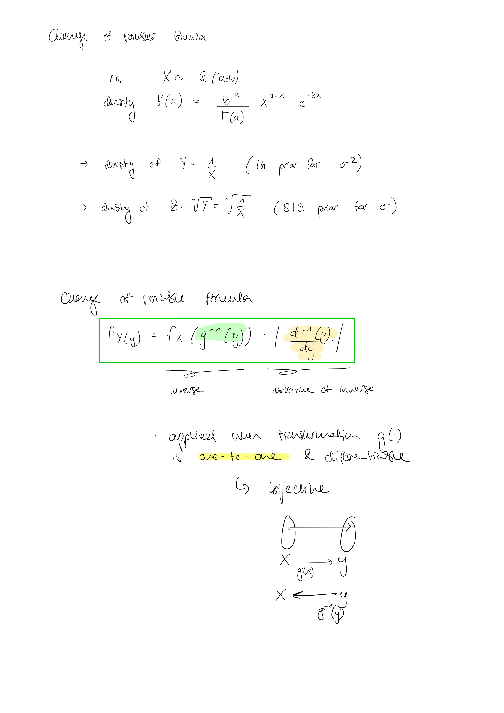
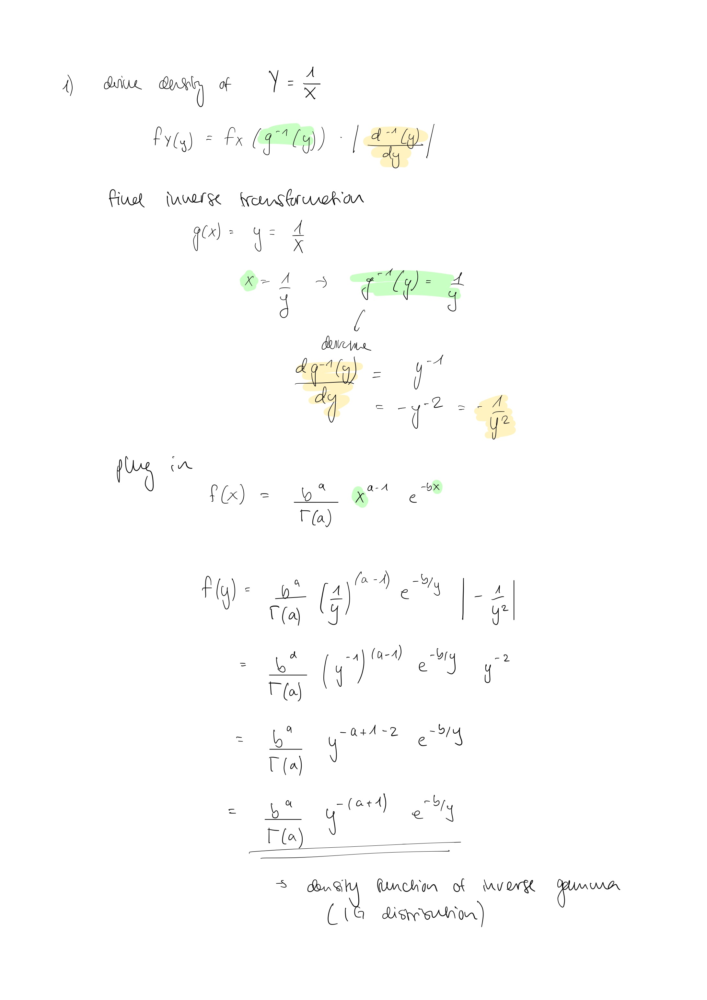
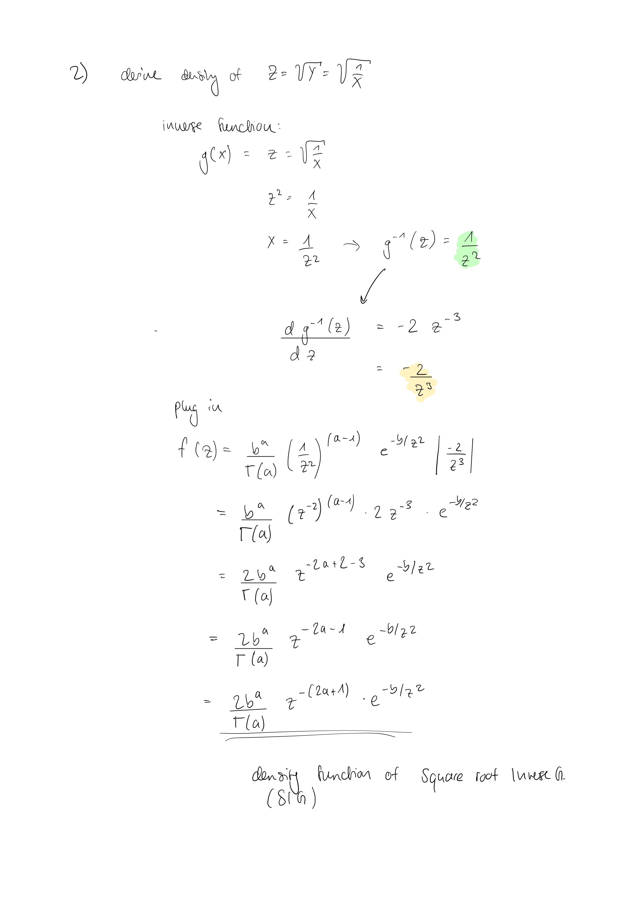

```{r setup, include=FALSE}
# Set chunk options here 

knitr::opts_chunk$set(echo = TRUE)
```

```{r, message = F}
library(tidyverse)
#library(rjags)
library(coda)
library(bayesmeta)
library(pCalibrate)
library(glue)
library(ggplot2)
```

## Exercise 4:

Apply analytical formulas derived in Exercise 3 above to the vector of height (cm) measurements 166, 168, 168, 177, 160, 170, 172, 159, 175, 164, 175, 167, 164 of 13 Swiss females.
Assume that $y_1, . . . ,y_n$ are observations generated by N(m, $\kappa^{-1}$) distribution with $\kappa$ = 1/900. Moreover, assume a N($\mu$, $\lambda^{-1}$) prior for m with $\mu$ = 161 and $\lambda$ = 1/70.

### a) Plot the prior predictive distribution for one observation y and compute its expectation and standard deviation. Estimate P[y > 200] for one future observation of Height.

The prior predictive distribution of one future observation y is N($\mu$, $\lambda^{-1}$+$\kappa^{-1}$).

```{r}
my_mu <- 161
my_lambda <- 1/70
my_kappa <- 1/900
my_seq <- seq(50, 270, by = 0.01)
plot(my_seq, dnorm(my_seq, mean = my_mu, sd = sqrt(1/my_lambda+1/my_kappa)), type = "l", main = "Prior predictive distribution", xlab = "Height (cm)", ylab = "Distribution")
expect <- my_mu
stand_dev <- sqrt(1/my_lambda + 1/my_kappa)
prob <- 1-pnorm(200, mean = my_mu, sd = sqrt(1/my_lambda + 1/my_kappa))
```
The expectation is `r expect` and the standard deviation is `r round(stand_dev,3)`.

P[y >200] for one future observation of Height is `r round(prob, 3)`.

### b) Plot the posterior predictive distribution for one future observation $y_{n+1}$ given that $y_1, . . . ,y_n$ have been observed and compute its expectation and standard deviation. Estimate P[$y_{n+1}$ > 200$y_1, . . . , y_n$] for one future observation $y_{n+1}$ of Height.

```{r}
obs <- c(166, 168, 168, 177, 160, 170, 172, 159, 175, 164, 175, 167, 164)
n <- length(obs)
mean_obs <- mean(obs)

mu_post <- (my_kappa*n*mean_obs+my_lambda*my_mu)/(n*my_kappa+my_lambda)
lambda_post <- n*my_kappa+my_lambda

curve(dnorm(x, mean = mu_post, sd = sqrt(1/lambda_post+1/my_kappa)), xlab = "Height (cm)", ylab = "Distribution", from = 50, to = 300, lwd = 2, col = "black", ylim = c(0,0.013))
curve(dnorm(x, mean = my_mu, sd = sqrt(1/my_lambda+1/my_kappa)), from = 50, to = 300, lwd = 2, add = TRUE, col = "blue")
legend("topright", legend = c("posterior", "prior"), col = c("black", "blue"), lwd = 2)

prob_post <- 1-pnorm(200, mean = mu_post, sd = sqrt(1/lambda_post+1/my_kappa))

```
The expectation is `r round(mu_post,3)` and the standard deviation is `r round(sqrt(1/lambda_post+1/my_kappa),3)`.

P[y$_{n+1}$ >200] for one future observation of Height is `r round(prob_post,3)`.


### c) Compare the results obtained for predictive distribution with those obtained for the posterior in Exercise 4 of Worksheet 2. Discuss how much posterior, prior predictive, and posterior predictive distributions differ.

In Exercise 4 of Worksheet 2 the posterior distribution of m|$y_1, . . . ,y_n$ was derived. Whereas in this worksheet's exercise 4 the posterior distribution of $y_{n+1}|y_1, . . . , y_n$ was derived.
The values for the mean of the posterior predictive distribution are the same (164.558). However, the standard deviations differ with much larger values for the posterior distribution of $y_{n+1}$.

The mean of the prior predictive distribution is with 161 lower than the mean of the posterior predictive distribution (164.558). This shift is due to a sample mean larger than 161. The variance of the posterior predictive distribution is with `r round((1/lambda_post+1/my_kappa),3)` slightly smaller than the variance of the prior predictive distribution (`r round(stand_dev^2,3)`).

## Exercise 5: 
Change-of-variables formula. Derivation of Inverse Gamma (IG) and Square Root Inverse Gamma (SIG) with parameters \(a = 1.6\) and \(b = 0.4\).









### Plots:


```{r, fig.show='hold'}
# shape parameters
a <- 1.6
b <- 0.4

# gamma
gamma_pdf <- function(x, a, b) {b^a / gamma(a) * x^(a-1) * exp(-b*x) 
}

# inverse gamma
IG_pdf <- function(y, a, b) b^a / gamma(a) * y^(-(a + 1)) * exp(-b / y)


# square root gamma
SIG_pdf <- function(z, a, b) 2 * b^a / gamma(a) * z^(-(2 * a + 1)) * exp(-b / (z^2))

# generate values
x_values <- seq(0.01, 5, length = 400)

# data frames for plotting
df_gamma <- data.frame(x = x_values, y = sapply(x_values, gamma_pdf, a, b), 
                       Distribution = 'Gamma')
df_IG <- data.frame(x = x_values, y = sapply(x_values, IG_pdf, a, b), 
                    Distribution = 'Inverse Gamma')
df_SIG <- data.frame(x = x_values, y = sapply(x_values, SIG_pdf, a, b), 
                     Distribution = 'Sqrt Inverse Gamma')

# combine data frames
df <- rbind(df_gamma, df_IG, df_SIG)

# plotting all 
ggplot(df, aes(x = x, y = y, color = Distribution)) + 
  geom_line() + 
  theme_minimal() +
  labs(title = 'Densities of X, Y, and Z', x = 'Value', y = 'Density') +
  scale_color_manual(values = c('Gamma' = 'blue', 
                                'Inverse Gamma' = 'red', 
                                'Sqrt Inverse Gamma' = 'green'))

```
```{r, fig.show='hold'}

# filter data frame for domain range between 0 and 0.5 
df_filtered <- df[df$x <= 0.5,]

# plotting Y and Z for the range 0 to 0.5
ggplot(df_filtered[df_filtered$Distribution != 'Gamma', ], 
       aes(x = x, y = y, color = Distribution)) + 
  geom_line() + 
  theme_minimal() +
  labs(title = 'Densities of Y and Z (0 to 0.5)', x = 'Value', y = 'Density') +
  scale_color_manual(values = c('Inverse Gamma' = 'red', 
                                'Sqrt Inverse Gamma' = 'green'))

```


### Interpretation:
- The **IG(1.6, 0.4)** distribution spikes quickly in the assignment of probabilities, showing a sharp increase in probability for small values. 
- The **SIG(1.6, 0.4)** distribution assigns probability 0 to values (very!) close to 0, indicating a rapid decrease in probability near 0. However, this increase in probability doesn't occur until around 0.2, indicating a slower rise in probability compared to the IG distribution.

