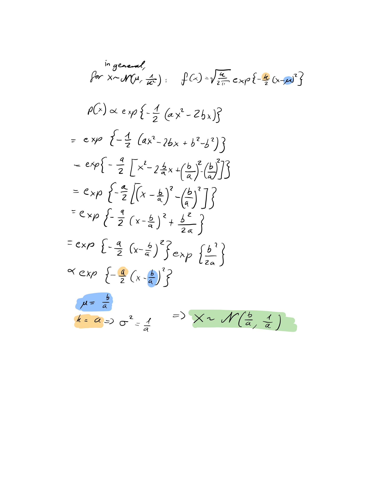

```{r setup, include=FALSE}
# Set chunk options here 
knitr::opts_chunk$set(echo = TRUE)
```

```{r, message = F}
library(tidyverse)
library(rjags)
library(coda)
library(bayesmeta)
library(pCalibrate)
library(glue)
library(INLA)
library(latex2exp)
```

## Exercise 2

### a)

See figure below

```{r pressure, echo=FALSE, fig.cap="Exercise 2 a", out.width = '100%'}

```

### b)

#### 1)

The following code is taken from the provided `04GibbsSampler2.r`:
```{r}
set.seed(44566)
mu <- 4
sigma2 <- 16
n <- 30
y <- rnorm(n=n, mean=mu, sd=sqrt(sigma2))
```

#### 2)

The following code is taken from the provided `04GibbsSampler2.r`:
```{r, results = "hold"}
mu0 <- -3
sigma2_0 <- 4
a0 <- 1.6
b0 <- 0.4

n.iter <- 10000
n.burnin <- 4000
n.thin <- 1
#n.thin <- floor((n.iter-n.burnin)/500)
n.chains <- 1
parameters <- c("mu", "sigma2", "inv_sigma2")
n.parameters <- length(parameters)

n.tot <- n.burnin + n.iter*n.thin

gibbs_samples <- matrix(NA, nrow = n.iter, ncol = n.parameters)
colnames(gibbs_samples) <- parameters

mu.sim <- rep(NA, length = n.tot)
sigma2.sim <- rep(NA, length = n.tot)
inv.sigma2.sim <- rep(NA, length = n.tot)

#Set the initial value
sigma2.sim[1] <- 1/runif(n.chains)

# set the counter
k <- 1

#Run the for loop (only one chain)
for(i in 2:(n.burnin+n.iter*n.thin)){

  mu.sim[i] <- rnorm(1,
                     mean = (sum(y)/sigma2.sim[i-1] + mu0/sigma2_0) /
                       (n/sigma2.sim[i-1] + 1/sigma2_0),
                     sd = sqrt(1/(n/sigma2.sim[i-1] + 1/sigma2_0)))

  sigma2.sim[i] <- 1/rgamma(1, shape = n/2 + a0,
                            scale = 1 / (sum((y-mu.sim[i])^2)/2 + b0))

  inv.sigma2.sim[i] <- 1/sigma2.sim[i]

  # after the burnin save every n.thin'th sample
  if((i > n.burnin) && (i%%n.thin == 0)){
    gibbs_samples[k,] <- c(mu.sim[i], sigma2.sim[i], inv.sigma2.sim[i])
    k <- k + 1
  }

  if(i%%1000 == 0){
    # report on the fly in which iteration the chain is
    cat(i, "\n")
  }
}
# n.iter samples after n.burnin taking every n.thin'th sample
dim(gibbs_samples)
head(gibbs_samples)

mu_gibbs_samples <- gibbs_samples[,"mu"]
sigma2_gibbs_samples <- gibbs_samples[,"sigma2"]
inv_sigma2_gibbs_samples <- gibbs_samples[,"inv_sigma2"]
```

Own code:
```{r, results = "hold"}
gibbs_samples_df <- as.data.frame(gibbs_samples)
gibbs_samples_df$iteration <- 1:nrow(gibbs_samples_df)


plot_traceplot <- function(samples, parameter, name){
  ggplot(samples, aes(x = iteration, y = get(parameter))) +
    geom_line() +
    labs(
      title = "Traceplot for ${name}$" |> glue() |> TeX(), 
      x = "Iteration", 
      y = "${name}$" |> glue() |> TeX())
}
plot_traceplot(gibbs_samples_df, "mu", "\\mu")
plot_traceplot(gibbs_samples_df, "sigma2", "\\sigma^2")
plot_traceplot(gibbs_samples_df, "inv_sigma2", "1/\\sigma^2")

print_summaries <- function(samples, parameter){
  "Summary of {parameter}:" |> glue() |> message()
  "Mean: {formatC(mean(samples), 5)}\n" |> glue() |> print() 
  "Standard deviation: {formatC(sd(samples), 5)}\n" |> glue() |> print() 
  "Quantiles:" |> glue() |> print() 
  quantile(samples, c(0.025, 0.5, 0.975)) |> print()
  "\n" |> glue() |> print() 
}

print_summaries(mu_gibbs_samples, "mu")
print_summaries(sigma2_gibbs_samples, "sigma^2")
print_summaries(inv_sigma2_gibbs_samples, "1/sigma^2")
```

#### 3)

The following code is taken from the provided `04GibbsSampler2.r`:
```{r}
formula <- y ~ 1
inla.output <- inla(formula,data=data.frame(y=y),
                    control.family = list(hyper =
                                            list(prec = list(prior="loggamma",param=c(a0,b0)))),
                    control.fixed = list(mean.intercept=mu0, prec.intercept=1/sigma2_0))
```

Own code:
```{r, results = "hold"}
"INLA Results" |> message()
"mu: {inla.output$summary.fixed$mean}" |> glue()
"sigma^2: {1/inla.output$summary.hyperpar$mean}" |> glue()
"1/sigma^2: {inla.output$summary.hyperpar$mean}" |> glue()
"\n" |> glue()

"Gibbs Sampler Results" |> message()
"mu: {mean(mu_gibbs_samples)}" |> glue()
"sigma^2: {mean(sigma2_gibbs_samples)}" |> glue()
"1/sigma^2: {mean(inv_sigma2_gibbs_samples)}" |> glue()
"\n" |> glue()

"Accuracy in percent" |> message()
print_accuracy <- function(expected, actual, name) {
  accuracy <- 1 - abs(expected - actual) / expected
  accuracy <- accuracy * 100
  accuracy <- round(accuracy, 2)
  "{name}: {accuracy}%" |> glue() |> print()
}

print_accuracy(inla.output$summary.fixed$mean, mean(mu_gibbs_samples), "mu")
print_accuracy(1/inla.output$summary.hyperpar$mean, mean(sigma2_gibbs_samples), "sigma^2")
print_accuracy(inla.output$summary.hyperpar$mean, mean(inv_sigma2_gibbs_samples), "1/sigma^2")
```

The results are fairly close to the INLA results. Note that the accuracy of the precision is much better than the accuracy of the variance!
These results would be even better if we let the simulation run for longer. This sampling took about 2 seconds on my machine, while real simulations can in practice take hours.

#### 4)

Step by step explanation of the code:

```r
mu0 <- -3
sigma2_0 <- 4
a0 <- 1.6
b0 <- 0.4
```
These are the (given) parameters for the prior distributions.

```r
n.iter <- 10000
n.burnin <- 4000
n.thin <- 1
#n.thin <- floor((n.iter-n.burnin)/500)
```
These are the settings for the Gibbs sampler. The number of iterations is set to 10000, the burn-in length to 4000, and the thinning parameter to 1. 
The burn-in is the period at the beginning of the simulation where the chain is not yet in equilibrium, so we cannot expect the samples to be representative of the posterior distribution. The thinning parameter is used to reduce the autocorrelation between samples. As we use a thinning parameter of 1, it is effectively nonexistent.

```r
n.chains <- 1
parameters <- c("mu", "sigma2", "inv_sigma2")
n.parameters <- length(parameters)

n.tot <- n.burnin + n.iter*n.thin

gibbs_samples <- matrix(NA, nrow = n.iter, ncol = n.parameters)
colnames(gibbs_samples) <- parameters

mu.sim <- rep(NA, length = n.tot)
sigma2.sim <- rep(NA, length = n.tot)
inv.sigma2.sim <- rep(NA, length = n.tot)

#Set the initial value
sigma2.sim[1] <- 1/runif(n.chains)

# set the counter
k <- 1
```
These trivial lines just set up the variables and matrices that will be used in the Gibbs sampler.

```r
#Run the for loop (only one chain)
for(i in 2:(n.burnin+n.iter*n.thin)){
```
We run for the number of iterations plus the burn-in period. We start at 2 because we already set the initial value for sigma2.

```r
  mu.sim[i] <- rnorm(1,
                     mean = (sum(y)/sigma2.sim[i-1] + mu0/sigma2_0) /
                       (n/sigma2.sim[i-1] + 1/sigma2_0),
                     sd = sqrt(1/(n/sigma2.sim[i-1] + 1/sigma2_0)))
```

This is the update step for mu. We sample a new value for mu from a normal distribution with the mean and standard deviation as given in the formula. The mean is calculated from the data and the prior, and the standard deviation is calculated from the precision.

```r
  sigma2.sim[i] <- 1/rgamma(1, shape = n/2 + a0,
                            scale = 1 / (sum((y-mu.sim[i])^2)/2 + b0))

  inv.sigma2.sim[i] <- 1/sigma2.sim[i]
```
This is the update step for sigma2. We sample a new value for sigma2 from a gamma distribution with the shape and scale as given in the formula. The shape is calculated from the data and the prior, and the scale is calculated from the precision.

```r
  # after the burnin save every n.thin'th sample
  if((i > n.burnin) && (i%%n.thin == 0)){
    gibbs_samples[k,] <- c(mu.sim[i], sigma2.sim[i], inv.sigma2.sim[i])
    k <- k + 1
  }
  ```
This part saves the samples after the burn-in period and only every n.thin'th sample because of the thinning parameter. Since our thinning parameter is 1, we save every sample.

```r
  if(i%%1000 == 0){
    # report on the fly in which iteration the chain is
    cat(i, "\n")
  }
}
```
This part prints the current iteration every 1000th iteration. This is useful to keep track of the algorithm to know that the simulation is still running and how far it has progressed.

```r
# n.iter samples after n.burnin taking every n.thin'th sample
dim(gibbs_samples)
head(gibbs_samples)

mu_gibbs_samples <- gibbs_samples[,"mu"]
sigma2_gibbs_samples <- gibbs_samples[,"sigma2"]
inv_sigma2_gibbs_samples <- gibbs_samples[,"inv_sigma2"]
```
This finally saves the samples for mu, sigma2, and 1/sigma2 in separate vectors.


\newpage

# Exercise 3

### 1 

Explain step by step in your own words what the code in 04MHSampler.R is doing.

\hrulefill

Preparation:

-	Cleaning the environment; storing the dosage values, centered dosage values, number of deaths, and total number of mice in vectors

- Defining the variance for the normal priors

-	Creating a function that takes the intercept and slope ($\alpha$ and $\beta$) and x (dosage) as input and returns the inverse logit function of the log-odds $\alpha + \beta x$, i.e. it projects it onto a scale between 0 and 1 and returns the corresponding p, which is the probability of death.

-	Setting a seed, defining the number of iterations; burn-in length; and thinning parameter

-	Preparing two empty vectors to store the sampled alpha and betas; two vectors with 0's of the length "number of iterations times thinning parameter", to record whether the proposals were accepted (1) or not (0); initial start values for alpha and beta; the standard deviations for the proposal distributions of alpha and beta (tuning parameters); and a counter that will track the counts of the for-loop

-	The for-loop is set up to go from –burninlength (negative) to the number of desired iterations times the thinning parameter. The current loop number is called i.

\bigskip

For-Loop:

1.	At the beginning of each loop, the counter is updated by 1 (however it's not really needed)

2.	A new proposal for alpha (alpha*) is sampled from the proposal distribution, which is a univariate normal distribution centered around the current alpha with a pre-defined standard deviation (tuning parameter).

3.	The inverse-logit function transforms $\alpha^* + \beta x$ into probability of death pi on a scale from 0 to 1. X is a vector of dosages so it returns a vector of pi's. The pi's are then passed as parameters to the binomial distribution function to calculate the log-likelihood of the observed proportions of dead mice given the corresponding pi. The log-likelihood is then added to the log of the prior density for alpha*. The prior follows a normal distribution with mean 0 and an assumed variance. The sum of the log-likelihood and the log-prior is proportionate to the log-posterior.

4.	Step 3 is done again but this time with the current/old alpha value, instead of alpha*.

5.	IF the difference of the log-posterior for alpha* minus the log-posterior for the old alpha is larger than a random value sampled from a standard uniform distribution, alpha* gets accepted and is now considered the current alpha. If not, the current alpha keeps its value.

6.	Only if burn-in period is finished, i.e. if i $\geqslant$ 1 (otherwise this step is skipped): the current element in the acceptance vector for alpha is changed to 1 if the proposed alpha* was accepted, otherwise it keeps the default value 0.

7.	Still within the same iteration, steps 2-6 are now repeated but for the beta parameter (slope)

8.	Only if burn-in period is finished, i.e. if i $\geqslant$ 1 (otherwise this step is skipped): the current alpha and beta samples are stored in their corresponding vector. They are stored whether the values got accepted or not. If the thinning parameter k is $\neq$ 1, only every k'th sample is stored in the vector. 

9.	Only if burn-in period is finished, i.e. if i $\geqslant$ 1 (otherwise this step is skipped): the acceptance rates are printed for every 1000th iteration, to keep track of the algorithm. The acceptance rate is the current number of accepted alphas resp. betas post-burn-in-period divided by the current nr. of iterations i.


\newpage 

### 2 

Comment on the differences in traceplots, auto-correlations (acf()) and cross-correlations depending on the tuning parameters’ choice. What are the reasons for observed differences?

\hrulefill

```{r}

rm(list=ls())

## Metropolis-Hastings for logistic model
## Two independent normal proposals

# the covariate values (dose)
x_original <- c(0.0028, 0.0028, 0.0056, 0.0112, 0.0225, 0.0450)
# the centered covariate values
x <- x_original - mean(x_original)
# number of mice deaths
y <- c(26, 9, 21, 9, 6, 1)
# total number of mice
n <- c(28, 12, 40, 40, 40, 40)

# Assumption
# variance of normal priors
sigma2 <- 10^(4)

# inverse logit: logit^(-1)(alpha + beta*x)
mypi <- function(alpha, beta, x){
  tmp <- exp(alpha + beta*x)
  pi <- tmp/(1+tmp)
  return(pi)
}

## Step 1: R: (univariate proposal) Metropolis MCMC settings 

# number of MCMC iterations
n.iter <- 10000 
# burnin length
n.burnin <- 4000
# thinning parameter
n.thin <- 1
#n.thin <- floor((n.iter-n.burnin)/500)

## Putting everything into a function to then call it for tuning parameters
## univariate random walk proposals ##
MCMC_MH <- function(s_alpha, s_beta){ # Input: SD's of proposal distributions
  
  set.seed(44566)
  alpha_samples <- c()
  beta_samples <- c()
  # number of accepted proposals
  alpha_yes <- rep.int(0, times = n.thin*n.iter)
  beta_yes <- rep.int(0, times = n.thin*n.iter)
  
  # starting values
  alpha <- 0
  beta <- 0
  # counter
  count <- 0
  
  # start the MCMC algorithm (the first iteration after the burn-in is 1)
  for(i in -n.burnin:(n.iter*n.thin)){
    count <- count +1
    
    ## update alpha
    # generate a new proposal for alpha
    alpha_star <- rnorm(1, alpha, sd=s_alpha)
    # NOTE: it is more stable to calculate everything on the log scale
    enum <- sum(dbinom(y, size=n, prob=mypi(alpha_star, beta, x), log=TRUE)) + 
      dnorm(alpha_star, mean=0, sd=sqrt(sigma2), log=TRUE)
    denom <- sum(dbinom(y, size=n, prob=mypi(alpha, beta, x), log=TRUE))  + 
      dnorm(alpha, mean=0, sd=sqrt(sigma2), log=TRUE)
    
    # log accetpance rate (since we use a random walk proposal there is no
    #	proposal ratio in the acceptance probability)
    logacc <- enum - denom
    if(log(runif(1)) <= logacc){
      # accept the proposed value
      alpha <- alpha_star
      if (i > 0){
        alpha_yes[i] <- 1
      }
    }
    
    ## update beta
    # generate a new proposal for beta
    beta_star <- rnorm(1, beta, sd=s_beta)
    enum <- sum(dbinom(y, size=n, prob=mypi(alpha, beta_star, x), log=TRUE)) + 
      dnorm(beta_star, mean=0, sd=sqrt(sigma2), log=TRUE)
    denom<- sum(dbinom(y, size=n, prob=mypi(alpha, beta, x), log=TRUE)) + 
      dnorm(beta, mean=0, sd=sqrt(sigma2), log=TRUE)
    # log accetpance rate
    logacc <- enum - denom
    
    if(log(runif(1)) <= logacc){
      # accept the proposed value
      beta <- beta_star
      if (i > 0){
        beta_yes[i] <- 1
      }
    }
    
    # after the burnin save every kth sample
    if((i > 0) && (i%%n.thin == 0)){
      alpha_samples <- c(alpha_samples, alpha)
      beta_samples <- c(beta_samples, beta)
    }
    # if((i > 0) && i%%1000 ==0){ ### skipping this
      # print the acceptance rates on the fly
      # cat(c(i, sum(alpha_yes)/i, sum(beta_yes)/i), "\n")
      #}
  }
  
  
  ## Plot results:
    
  # Traceplots
  print(glue("Traceplots:\n"))
  par(mfrow = c(1,2),mar = c(8, 5, 8, 1))
  plot(alpha_samples, type = "l", ylab = "Alpha", xlab = "Iteration")
  plot(beta_samples, type = "l", ylab = "Beta", xlab = "Iteration")
  
  # Autocorrelation plots
  print(glue("Autocorrelation and Cross-Correlation:"))
  par(mfrow = c(1,3), mar = c(8, 4, 12, 1), oma = c(1,1,3,1) )
  acf(alpha_samples, ylab = "ACF for alpha", main = "")
  acf(beta_samples, ylab = "ACF for beta", main = "")
  
  # Crosscorrelation
  ccf(alpha_samples, beta_samples, ylab = "Cross Correlation", main = "")
  
  # Acceptance Rates
  acceptance_alpha <- sum(alpha_yes)/(n.iter*n.thin)
  acceptance_beta <- sum(beta_yes)/(n.iter*n.thin)
  print(glue("Acceptance rate alpha: {acceptance_alpha} "))
  print(glue("Acceptance rate beta: {acceptance_beta} "))
  
  # Return MCMC and acceptance rate for alpha and beta
  return( list(alpha_samples, beta_samples, acceptance_alpha, acceptance_beta ) )

}
```


\newpage

Now calling the function MCMC_MH to show the results:

\bigskip

```{r}
# Defining 3 different sets of tuning parameters
s_alpha <- c(0.01, 1, 50)
s_beta <- c(1, 100, 5000 )
```

\bigskip
\bigskip

Results for low tuning parameters (0.01, 1):

\bigskip

```{r}
MCMC_1_result <- MCMC_MH(s_alpha[1], s_beta[1])

```


The tuning parameters are the SDs of the proposal distributions for alpha and beta. With small tuning parameters, the proposal distributions are narrow. The new alpha and beta values are likely to be very close to the previous alpha and beta values, the exploration of the parameter space is done in small steps, so there is high autocorrelation and cross-correlation over many lags. The sampler doesn't take any "big risks" and so the acceptance rate is very high, but it doesn't explore the parameter space well. Also it can drift off and then it takes a lot of iterations to get back again to the region of high posterior density. It's not stationary.

\newpage

Results for medium tuning parameters (1, 100):

\bigskip

```{r}
MCMC_2_result <- MCMC_MH(s_alpha[2], s_beta[2])
```

With optimal SDs for the proposal distributions, the sampler has a good balance between exploration of the parameter space and acceptance rate. The traceplot is stationary. The sampler moves rapidly across the whole parameter space without getting stuck, leading to the characteristic caterpillar shape, and autocorrelation and cross-correlation quickly decaying to zero. 


\newpage

Results for high tuning parameters (50, 5000):

\bigskip

```{r}

MCMC_3_result <- MCMC_MH(s_alpha[3], s_beta[3])

```

Here the SDs of the proposal distributions are large, leading to "adventurous" exploration, so the sampler often proposes parameter values far outside in the parameter space, under which the data is unlikely, leading to low acceptance rates. Due to low acceptance rates, the chain is often stuck at the same value over several iterations, leading to these skyline-like traceplots with constant values over several iterations and thus high autocorrelation over many lags. Only sporadically there's a big jump when the sampler proposes a value that is accepted by chance. There is also high cross-correlation over many lags because the samples stay constant over many iterations. 

 
\newpage

### 3 

Under which condition the optimal acceptance rate of about 0.2-0.4 ("rule of thumb") is attained?

\hrulefill

With medium tuning parameters (1, 100), the acceptance rates are optimal:  
Acceptance rate alpha: `r MCMC_2_result[3]`
Acceptance rate beta: `r MCMC_2_result[4]`  

\bigskip
\bigskip

### 4

Provide summaries (mean, sd, 0.025, 0.5, 0.975 quantiles) of the marginal posteriors for alpha and beta for the middle choice of tuning parameters.

\hrulefill

\bigskip

```{r, results = "hold"}

alphas_2 <- unlist(MCMC_2_result[1])

glue("Mean alpha: {formatC(mean(alphas_2), 5)} ")
glue("SD alpha: {formatC(sd(alphas_2), 5)} ")
glue("Quantiles:")
quantile(alphas_2, c(0.025, 0.5, 0.975) ) 
```

\bigskip

```{r, results = "hold"}
betas_2 <- unlist(MCMC_2_result[2])

glue("Mean beta: {formatC(mean(betas_2), 5)} ")
glue("SD beta: {formatC(sd(betas_2), 5)} ")
glue("Quantiles:")
quantile(betas_2, c(0.025, 0.5, 0.975) ) 
```
\newpage

### 5

Plot the logistic curve for median posterior values of $\alpha$ and $\beta$ together with data and interpret the result.

\hrulefill

\bigskip

```{r}
median_alpha <- median(alphas_2)
median_beta <- median(betas_2)

curve( mypi(median_alpha, median_beta, x), from = -0.015, to = 0.04, ylim = c(0,1),
       xlab = "Dosage of anti-pneumococcus serum", 
       ylab = "probability of death, p", xaxt = 'n', col = "darkblue", lwd = 2,
       main = "Higher dosages reduce probability of death" )
# Converting the dosages back to the uncentered, original values
breaks <- seq(-0.015, 0.04, by = 0.01)  
axis(1, at = breaks, labels = as.character(round(breaks + mean(x_original), 2)) )
points(x, y/n, pch = 19, col = "tomato")
legend("topright", legend = c( "Fit", "Original data"), 
       bty = "n", col = c("darkblue", "tomato"), lty = c(1,NA), pch = c(NA,19), lwd = c(2,NA) )
```

\bigskip

The resulting median beta is `r round(median_beta,3)` and median alpha is `r round(median_alpha,3)`.The modelled logistic curve is a good fit for the data, but it might slightly underestimate p for very low dosages. High dosages lead to lower probability of death, which is reflected in the negative beta value, and p is basically zero for dosages higher than 0.045. Of course, if the dosage would be too high, this might again be fatal, but this was not modelled here. For 1 unit increase in dosage x, the odds of death change by a factor of $exp(\beta)$, but since 1 unit is not really the scale that we're interested in, we could say that for an increase in dosage by 0.01, the odds of death change by a factor of $exp(\beta * 0.01) =$ `r round(exp(median_beta * 0.01),3)`.


