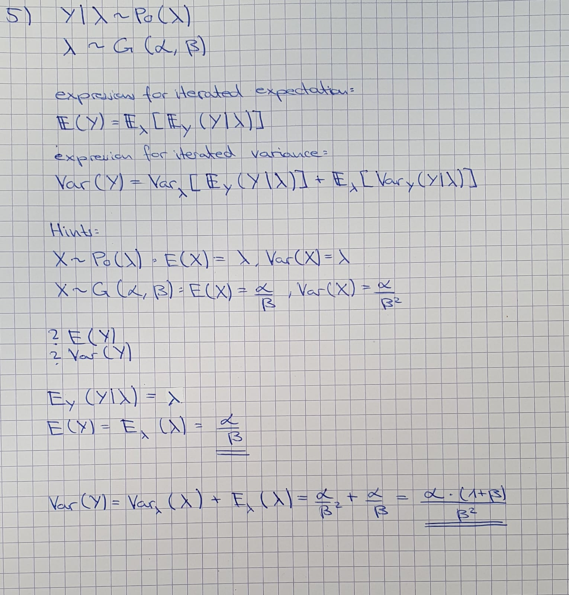

```{r setup, include=FALSE}
# Set chunk options here 
knitr::opts_chunk$set(echo = TRUE)
```

```{r, message = F}
library(tidyverse)
library(bayesmeta)
```

## Exercise 3

Data:
```{r}
dat <- 
  tibble(
    pl_total = c(107,44,51,39,139,20,78,35),
    pl_case = c(23,12,19,9,39,6,9,10),
    tr_total = c(208,38,150,45,138,20,201,34),
    tr_case = c(120,18,107,26,82,16,126,23),
  ) |>
  mutate(
    n_pl_case = pl_total - pl_case,
    n_tr_case = tr_total - tr_case,
    labels = c("Adalimumab 1", "Adalimumab 2", "Etanercept 1", "Etanercept 2", "Etanercept 3", "Etanercept 4", "Infliximab 1", "Infliximab 2")
  ) |>
  mutate(
    or = (pl_case / n_pl_case) / (tr_case / n_tr_case),
  ) |>
  mutate(
    log_or = log(or),
    se_log_or = sqrt(1 / pl_case + 1 / n_pl_case + 1 / tr_case + 1 / n_tr_case),
  )
```

Analysis:
```{r}
res1 <- bayesmeta(
  y = dat$log_or,
  sigma = dat$se_log_or,
  labels = dat$labels,
  mu.prior.mean = 0, 
  mu.prior.sd = 4,
  tau.prior = \(t) dhalfnormal(t, scale = 0.5),
  interval.type = "central"
)
```

Plots:
```{r}
res1 |> summary()
res1 |> forestplot()
res1 |> funnel()
res1 |> traceplot()
res1 |> weights()
```

TODO: Report results


\newpage

## Exercise 4

(Bayesian meta-analysis with JAGS)

Run R code provided in the file 06worksheet_JAGSextension.R. This model provides an alternative analysis of data considered in the Exercise 3 above. Discuss similarities and differences of the model provided in this R code and models that were used for Bayesian meta-analyses in the Exercise 3 above and in the individual project (Exercise 1 of Worksheet 5).  

\hrulefill

\bigskip

```{r}
pl1.data<-list(N = 16, 
               y = c(23., 12., 19.,  9.,  39.,  6.,  9., 10., 120., 18., 107., 
                     26., 82., 16., 126., 23.),
               n = c(107., 44., 51., 39., 139., 20., 78., 35., 208., 38., 150., 
                     45., 138., 20., 201., 34.),
               C1 = c(0., 0., 0., 0., 0., 0., 0., 0., 1., 1., 1., 1., 1., 1., 1., 1.))


pl1.params<-c("mu", "beta", "tau", "p1.star", "p2.star")


pl1_modelString <- "
model 
{

#	sampling model (likelihood)
for (j in 1:N)	{
y[j] ~ dbin(p[j],n[j])
logit(p[j]) <- mu + beta*C1[j] + eta[j]
eta[j] ~ dnorm(0, tau.prec)

#	prediction for posterior predictive checks
y.pred[j] ~ dbin(p[j],n[j])
PPC[j] <- step(y[j]-y.pred[j])-0.5*equals(y[j],y.pred[j])
}

#	priors
mu ~ dunif(-10,10)
beta ~ dunif(-10,10)
tau ~ dunif(0,10)
tau.prec <- 1/tau/tau

#	population effect
p1 <- 1/(1+exp(-mu)) 
p2 <- 1/(1+exp(-mu-beta))

#	predictive distribution for new study effect
eta.star ~ dnorm(0,tau.prec)
p1.star <- 1/(1+exp(-mu-eta.star))
p2.star <- 1/(1+exp(-mu-beta-eta.star))

}
"

writeLines(pl1_modelString, con="TempModel.txt") # write to a file

# model initiation
rjags.pl1 <- jags.model(
  file = "TempModel.txt", 
  data = pl1.data,
  n.chains = 4,
  n.adapt = 4000
)

# str(rjags.pl1)
# class(rjags.pl1)
# attributes(rjags.pl1)

# burn-in

update(rjags.pl1, n.iter = 4000)

# sampling/monitoring
fit.rjags.pl1.coda <- coda.samples(
  model = rjags.pl1, 
  variable.names = pl1.params, 
  n.iter = 10000,
  thin = 1
)

summary(fit.rjags.pl1.coda)
plot(fit.rjags.pl1.coda)

```


\bigskip

Model in 06worksheet_JAGSextension.r:  

- models the study-specific number of responders as a binomial random variable

- the parameter p of this study-specific binomial is modeled as a logistic regression with mu (overall mean) + treatment effect or 0 if placebo + eta (study-specific random effect)

- eta is drawn from a normal distribution to capture the study-specific variation

- includes posterior predictive checks

- uses uniform priors for mu, beta and tau (variance of error term eta) 

- On a global population level, the response rates for placebo and treatment are the inverse-logit-transformed predicted log-odds from the logistic regression

- For the predictive distribution of the response rate in a new study it adds a normal error term to the population response for the random effect of the studies


\bigskip

Model in worksheet 06 exercise 3:

- takes into account treatment
- includes a random effect for the studies
- study-specific effects follow a normal distribution with mean 0 and variance tau^2
- the prior of the overall effect size mu is a normal with mean 0 and sd 4
- the prior of the heterogeneity parameter is a halfnormal
- assumes normality of the log-odds
- does not include prior predictive checks


\bigskip

\bigskip

\bigskip

Model in worksheet 05:

```{r}
pl1_modelString = "
model {
for(i in 1:length(y)) {
  y[i] ~ dnorm(theta[i], prec_s[i]);
  theta[i] ~ dnorm(mu, prec_tau);
}
theta_new ~ dnorm(mu, prec_tau); # predictive distribution for theta
p_new <- exp(theta_new)/(1+exp(theta_new)); # predictive distribution at the probability scale
mu ~ dnorm(0.0, 1.0E-4);
prec_tau ~ dgamma(1.0E-3, 1.0E-3); # just our assumption
}
"
```

- models the study-specific log-odds as a normal random variable and then back-transforms it onto probability scale

- the study-specific mean log-odds is drawn from another normal distribution with mean mu and precision prec_tau

- only considers placebo data

- the predictive distribution of the log-odds for a new study is from the same distribution as the study-specific log-odds, i.e. a normal with mean mu and precision prec_tau, with no error term

- to get the predictive distributino of the response rate of a new study, it's inverse-logit-transformed

- the prior of mu is a normal distribution with fixed mean and precision

- the prior of prec_tau is a gamma distribution with fixed parameters

- the model does not include posterior predictive checks


\bigskip

Main differences:

- 06worksheet_JAGSextension.r includes a covariate for treatment
- worksheet 5 does not include a covariate for treatment, only models placebo
- exercise 3 includes treatment data

- 06worksheet_JAGSextension.R and exercise 3 include study-specific random effects
- Worksheet 05: Does not include random effects for the studies, only models the study-specific log-odds as normally distributed around mu

- They use different priors

- 06worksheet_JAGSextension.r includes posterior predictive checks
- worksheet 5 and exercise 3 do not include posterior predictive checks


\bigskip

Main similarities:

- all models are implemented within a Bayesian framework and incorporate prior distributions

\newpage

## Exercise 5
{width=40% height=60%}
