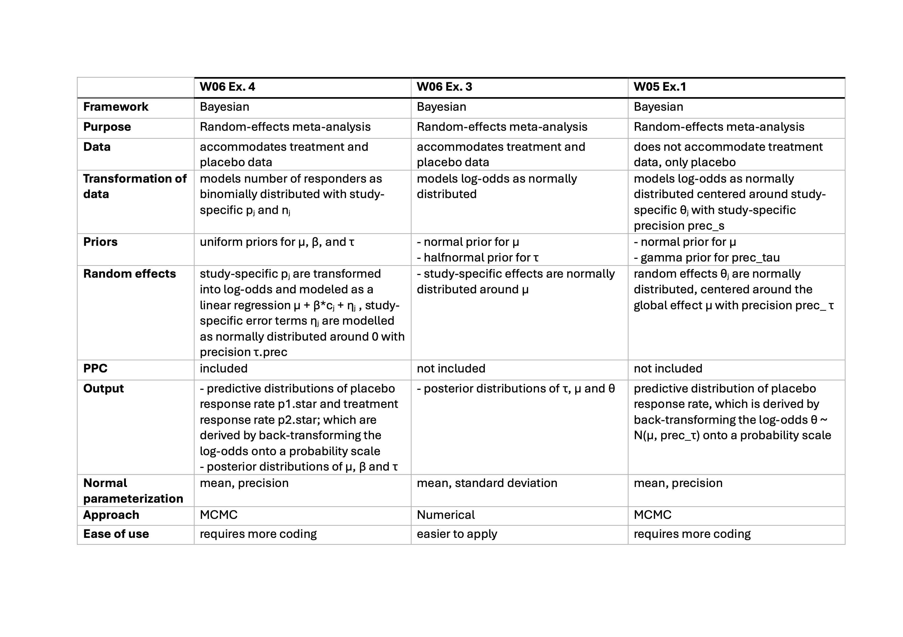

```{r setup, include=FALSE}
# Set chunk options here 
knitr::opts_chunk$set(echo = TRUE)
```

```{r, message = F}
library(tidyverse)
library(bayesmeta)
library(rjags)
```

## Exercise 3

Data:
```{r}
dat <- 
  tibble(
    pl_total = c(107,44,51,39,139,20,78,35),
    pl_case = c(23,12,19,9,39,6,9,10),
    tr_total = c(208,38,150,45,138,20,201,34),
    tr_case = c(120,18,107,26,82,16,126,23),
  ) |>
  mutate(
    n_pl_case = pl_total - pl_case,
    n_tr_case = tr_total - tr_case,
    labels = c("Adalimumab 1", "Adalimumab 2", "Etanercept 1", "Etanercept 2", "Etanercept 3", "Etanercept 4", "Infliximab 1", "Infliximab 2")
  ) |>
  mutate(
    or = (pl_case / n_pl_case) / (tr_case / n_tr_case),
  ) |>
  mutate(
    log_or = log(or),
    se_log_or = sqrt(1 / pl_case + 1 / n_pl_case + 1 / tr_case + 1 / n_tr_case),
  )
```

Analysis:
```{r}
res1 <- bayesmeta(
  y = dat$log_or,
  sigma = dat$se_log_or,
  labels = dat$labels,
  mu.prior.mean = 0, 
  mu.prior.sd = 4,
  tau.prior = \(t) dhalfnormal(t, scale = 0.5),
  interval.type = "central"
)
```

Plots:
```{r}
res1 |> summary()
res1 |> forestplot()
res1 |> funnel()
res1 |> traceplot()
res1 |> weights()
```

TODO: Report results


\newpage

## Exercise 4

(Bayesian meta-analysis with JAGS)

Run R code provided in the file 06worksheet_JAGSextension.R. This model provides an alternative analysis of data considered in the Exercise 3 above. Discuss similarities and differences of the model provided in this R code and models that were used for Bayesian meta-analyses in the Exercise 3 above and in the individual project (Exercise 1 of Worksheet 5).  

\hrulefill

\bigskip

```{r}
pl1.data<-list(N = 16, 
               y = c(23., 12., 19.,  9.,  39.,  6.,  9., 10., 120., 18., 107., 
                     26., 82., 16., 126., 23.),
               n = c(107., 44., 51., 39., 139., 20., 78., 35., 208., 38., 150., 
                     45., 138., 20., 201., 34.),
               C1 = c(0., 0., 0., 0., 0., 0., 0., 0., 1., 1., 1., 1., 1., 1., 1., 1.))


pl1.params<-c("mu", "beta", "tau", "p1.star", "p2.star")


pl1_modelString <- "
model 
{

#	sampling model (likelihood)
for (j in 1:N)	{
y[j] ~ dbin(p[j],n[j])
logit(p[j]) <- mu + beta*C1[j] + eta[j]
eta[j] ~ dnorm(0, tau.prec)

#	prediction for posterior predictive checks
y.pred[j] ~ dbin(p[j],n[j])
PPC[j] <- step(y[j]-y.pred[j])-0.5*equals(y[j],y.pred[j])
}

#	priors
mu ~ dunif(-10,10)
beta ~ dunif(-10,10)
tau ~ dunif(0,10)
tau.prec <- 1/tau/tau

#	population effect
p1 <- 1/(1+exp(-mu)) 
p2 <- 1/(1+exp(-mu-beta))

#	predictive distribution for new study effect
eta.star ~ dnorm(0,tau.prec)
p1.star <- 1/(1+exp(-mu-eta.star))
p2.star <- 1/(1+exp(-mu-beta-eta.star))

}
"

writeLines(pl1_modelString, con="TempModel.txt") # write to a file

# model initiation
rjags.pl1 <- jags.model(
  file = "TempModel.txt", 
  data = pl1.data,
  n.chains = 4,
  n.adapt = 4000
)

# str(rjags.pl1)
# class(rjags.pl1)
# attributes(rjags.pl1)

# burn-in

update(rjags.pl1, n.iter = 4000)

# sampling/monitoring
fit.rjags.pl1.coda <- coda.samples(
  model = rjags.pl1, 
  variable.names = pl1.params, 
  n.iter = 10000,
  thin = 1
)

summary(fit.rjags.pl1.coda)
plot(fit.rjags.pl1.coda)

```

\newpage

Comparison of models

\bigskip



\newpage

## Exercise 5
{width=40% height=60%}


## Exercise 6

# a) Numerical approximation
Numerical maximisation of the log-likelihood corresponding to the Poisson-gamma
distribution as described by (Held and Sabanés Bové, 2020, p. 210–211 and Fig. 6.13) to
obtain the marginal maximum likelihood estimator.
```{r}
# Data: observed counts of lip cancer cases
y <- c(11, 5, 15, 9, 6, 9, 2, 3, 26, 39, 20, 31, 9, 16, 6, 16, 19, 17, 15, 11, 19,
       7, 10, 0, 7, 7, 9, 2, 8, 8, 11, 6, 28, 4, 1, 1, 1, 8, 6, 3, 2, 1, 7, 10, 9, 11, 3,
       11, 5, 8, 3, 7, 0, 8, 7, 13)
# Sanity check: number of districts 
n <- length(y)
```

The log-likelihood function for the Poisson-Gamma model is given by (from the Book):

\[
l(\alpha, \beta) = \sum_{i=1}^{n} \left[ \alpha \log(\beta) + \log \left( \frac{\Gamma(\alpha + x_i)}{\Gamma(\alpha)} \right) - (\alpha + x_i) \log(\beta + e_i) \right]
\]

We want to maximize this log-likelihood function.
```{r}
# note that e_i = 1 and xi is our data y 
# Log-likelihood function
log.lik <- function(x) {
  alpha <- x[1]
  beta <- x[2]
  log.lik <- sum(alpha * log(beta) + log( (gamma(alpha + y))/(gamma(alpha)) ) -
              (alpha + y) * log(beta + 1))
  return(log.lik)
  }

# Maximize log-likelihood function
opt <- optim(par=c(0.1, 0.1), fn=log.lik, control = list(fnscale = -1))

# Print the maximum likelihood estimates
opt$par
alpha1 <- opt$par[1]
beta1 <- opt$par[2]
```


# b) Moments matching
Matching of moments based on the Exercise 5 above, which provides the marginal moment estimator.

{width=40% height=60%}
```{r}
# Moment-matching function
moment.matching <- function(mean, var) {
  alpha <- mean / (var/mean - 1)
  beta <- 1 / (var/mean - 1)
  return(params = c(alpha=alpha, beta=beta))
  }

params <- moment.matching(mean = mean(y), var = var(y))
alpha2 <- params[1]
beta2 <- params[2]
```

Compare means and the lengths of equi-tailed 95%CrI obtained by both approaches. 
Report your results.

```{r}
# Function to compute 95% credible intervals
credible_interval <- function(alpha, beta, y) {
  lower <- qgamma(0.025, alpha + y, rate = beta + 1)
  upper <- qgamma(0.975, alpha + y, rate = beta + 1)
  return(c(lower, upper))
}

# Compute credible intervals using MLE
CrI1 <- t(sapply(y, credible_interval, alpha = alpha1, beta = beta1))
CrI1
# Compute credible intervals using Method of Moments
CrI2 <- t(sapply(y, credible_interval, alpha = alpha2, beta = beta2))
CrI2

# Length of the credible intervals
lengths_1 <- CrI1[, 2] - CrI1[, 1]
lengths_2 <- CrI2[, 2] - CrI2[, 1]

# Compute posterior means
lambda_eb_1 <- (alpha1 + y) / (beta1 + 1)
lambda_eb_2 <- (alpha2 + y) / (beta2 + 1)

# Compare means and lengths of 95% credible intervals
mean_comparison <- data.frame(
  Statistic = c("Posterior Mean (MLE)", "Posterior Mean (MM)", "Length of 95% CrI (MLE)", "Length of 95% CrI (MM)"),
  Mean = c(mean(lambda_eb_1), mean(lambda_eb_2), mean(lengths_1), mean(lengths_2))
)

print(mean_comparison)
```

Practically the same. 
