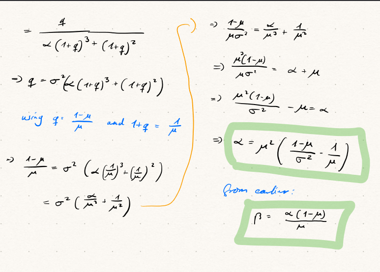

```{r setup, include=FALSE}
# Set chunk options here 

knitr::opts_chunk$set(echo = TRUE)
```

```{r, message=F}
library(tidyverse)
library(rjags)
library(coda)
library(bayesmeta)
library(pCalibrate)
library(ggthemes)
library(DescTools)

theme_set(theme_solarized_2())
```

## Exercise 1

```{r}
dat <- matrix(data = c(14, 9, 1, 5), ncol = 2, byrow = T)
rownames(dat) <- c("Secukinumab", "Placebo")
colnames(dat) <- c("Responder", "Not Responder")
dat |> addmargins()
```

### a)

```{r,results = "hold"}
glue::glue("P[Responder|Secukinumab]")
BinomCI(dat[1,1], sum(dat[1,]))
glue::glue("")

glue::glue("P[Responder|Placebo]")
BinomCI(dat[2,1], sum(dat[2,]))
```

Given only the data in the table, classical statistics suggest that the probability of a patient responding to Secukinumab is probably between 0.41 and 0.78, and the probability of a patient responding to placebo is between 0.03 and 0.56. These intervals overlap, so we cannot conclude that Secukinumab is more effective than placebo.

### b)

```{r}
ggplot(data.frame(x = c(0, 1)), aes(x)) +
  stat_function(
    fun = dbeta, 
    args = list(shape1 = 0.5, shape2 = 1), 
    linewidth = 1, 
    aes(colour = "Secukinumab: Beta(0.5, 1)")) +
  stat_function(
    fun = dbeta, 
    args = list(shape1 = 11, shape2 = 32), 
    linewidth = 1, 
    aes(colour = "Placebo: Beta(11, 32)")) +
  theme(legend.position = "top") +
  labs(
    title = "Prior distribution for P[Responder|Treatment]", 
       x = "P[Responder|Treatment]", 
    y = "Density") +
  scale_colour_solarized()
```

```{r,results = "hold"}
glue::glue("Secukinumab prior: Beta(0.5, 1)")
alpha1 <- 0.5
beta1 <- 1
mean1 <- alpha1/(alpha1 + beta1)
median1 <- qbeta(0.5, alpha1, beta1)
ci1 <- qbeta(c(0.025, 0.975), alpha1, beta1)
glue::glue("Mean: {mean1}")
glue::glue("Median: {median1}")
glue::glue("95% CrI: {ci1[1]} - {ci1[2]}")
glue::glue("")

glue::glue("Placebo prior: Beta(11, 32)")
alpha2 <- 11
beta2 <- 32
mean2 <- alpha2/(alpha2 + beta2)
median2 <- qbeta(0.5, alpha2, beta2)
ci2 <- qbeta(c(0.025, 0.975), alpha2, beta2)
glue::glue("Mean: {mean2}")
glue::glue("Median: {median2}")
glue::glue("95% CrI: {ci2[1]} - {ci2[2]}")
```

The prior for Secukinumab is weak and its credible interval covers pretty much the whole range of possible values. Since the distribution is heavily skewed, I prefer to use the median as a measure of central tendency. It is 0.25 in this case, but I wouldn't put too much weight on it since the prior is so weak ($\alpha + \beta = 0.5 + 1 = 1.5$).
The prior for placebo is much stronger and its confidence interval is much narrower ($\alpha + \beta = 11 + 32 = 43$). It is bell-shaped and thus the mean and median are very close. The true probability of a patient responding to placebo is probably around 0.25 and between 0.14 and 0.39.

### c)

```{r}
alpha1.post <- alpha1 + dat[1,1]
beta1.post <- beta1 + dat[1,2]

ggplot(data.frame(x = c(0, 1)), aes(x)) +
  stat_function(
    fun = dbeta, 
    args = list(shape1 = alpha1, shape2 = beta1), 
    linewidth = 1, 
    aes(colour = "Prior: Beta(0.5, 1)")) +
  stat_function(
    fun = dbeta, args = list(shape1 = alpha1.post, shape2 = beta1.post), 
    linewidth = 1, 
    aes(colour = "Posterior: Beta(14.5, 10)")) +
  theme(legend.position = "top") +
  labs(
    title = "Prior and Posterior distribution for P[Responder|Secukinumab]", 
    x = "P[Responder|Secukinumab]", 
    y = "Density") +
  scale_colour_solarized()
```

```{r,results = "hold"}
glue::glue(glue::glue("Secukinumab posterior: Beta({alpha1.post}, {beta1.post})"))
mean1.post <- alpha1.post/(alpha1.post + beta1.post)
median1.post <- qbeta(0.5, alpha1.post, beta1.post)
ci1.post <- qbeta(c(0.025, 0.975), alpha1.post, beta1.post)
glue::glue("Mean: {mean1.post}")
glue::glue("Median: {median1.post}")
glue::glue("95% CrI: {ci1.post[1]} - {ci1.post[2]}")
```

The posterior is much stronger than the prior and the credible interval is much narrower ($\alpha + \beta = 14.5 + 10 = 24.5$). Given our new data, the true probability of a patient responding to Secukinumab is probably around 0.59 and between 0.40 and 0.77.

### d)

```{r}
alpha2.post <- alpha2 + dat[2,1]
beta2.post <- beta2 + dat[2,2]

ggplot(data.frame(x = c(0, 1)), aes(x)) +
  stat_function(
    fun = dbeta,
    args = list(shape1 = alpha2, shape2 = beta2), 
    linewidth = 1, 
    aes(colour = "Prior: Beta(11, 32)")) +
  stat_function(
    fun = dbeta, 
    args = list(shape1 = alpha2.post, shape2 = beta2.post), 
    linewidth = 1, 
    aes(colour = "Posterior: Beta(12, 37)")) +
  theme(legend.position = "top") +
  labs(
    title = "Prior and Posterior distribution for P[Responder|Placebo]", 
    x = "P[Responder|Placebo]", 
    y = "Density") +
  scale_colour_solarized()
```

```{r,results = "hold"}
glue::glue(glue::glue("Placebo posterior: Beta({alpha2.post}, {beta2.post})"))
mean2.post <- alpha2.post/(alpha2.post + beta2.post)
median2.post <- qbeta(0.5, alpha2.post, beta2.post)
ci2.post <- qbeta(c(0.025, 0.975), alpha2.post, beta2.post)
glue::glue("Mean: {mean2.post}")
glue::glue("Median: {median2.post}")
glue::glue("95% CrI: {ci2.post[1]} - {ci2.post[2]}")
```

Our prior was already fairy strong and the new data is in line with it. Thus, our posterior is not much different from our prior. The true probability of a patient responding to placebo is probably around 0.24 and between 0.14 and 0.37.

## Exercise 2

### a)

See pictures below.

{width=60% height=60%}

{width=60% height=60%}

### b)

```{r}
estimate_beta_shapes <- function(mean, var) {
  alpha <- mean^2 * ((1 - mean)/var - 1/mean);
  beta <- alpha * (1 - mean)/mean;
  return(list(alpha = alpha, beta = beta));
}
```

### c)

```{r}
estimate_beta_shapes(mean = 0.255814, var = 0.004326663)
```

$\alpha = 11$ and $\beta = 32$. These are the values of our prior for the placebo group.
