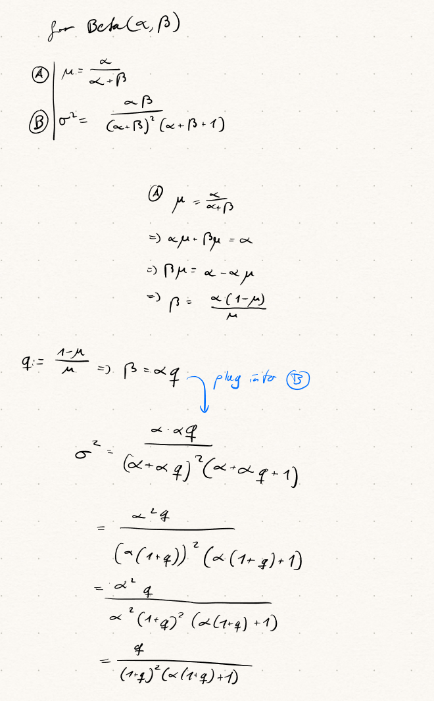
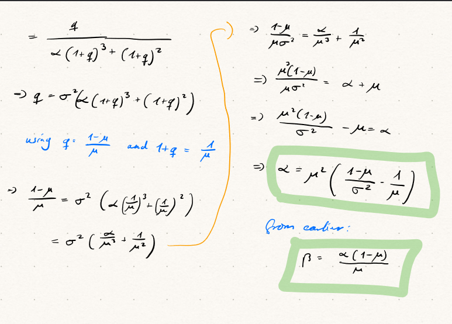

```{r setup, include=FALSE}
knitr::opts_chunk$set(echo = TRUE)
```


## About the Report

I wrote the final report as a kind of pseudo-paper. For my own convenience when looking this up in the future, I decided to mostly follow the conventions of a medical statistics paper with some modifications. Because the medical details of the study are of secondary importance, I left them out where possible. 

For the data and results, I used relevant code right in the text to make it easier for me to follow my own thought process. I did not include a dump of my R session because the code is written to be completely reproducible.

Gramatically, I used "we" to refer to myself and the original authors of Baeten et al. Thus, the paper is written as if I were part of the original study. 

The exercise sheets were not adapted chronologically, but rather by the order I expect their content to come up in practice.


## Abstract

## Introduction

### Big Problem in Science

### Narrower Problem in Science

### Yet Narrower Paper Gap

We investigate the safety and efficacy of Secukinumab for the treatment of ankylosing spondylitis compared to a placebo. Secukinumab is an antibody for IL-17, which is a pro-inflammatory cytokine believed to be involved in the pathogenesis of ankylosing spondylitis.

### Summary

## Code Setup

```{r, message = F}
library(tidyverse)
library(rjags)
library(coda)
library(bayesmeta)
library(pCalibrate)
library(ggthemes)
library(DescTools)
library(latex2exp)
library(glue)

theme_set(theme_solarized_2())
primary_colour <- scale_color_solarized()$palette(1)

# set seed
set.seed(42)
```

## Results

### Methods Summary

TODO

### Study Design and Sample Size Computation

We hypothesize a true underlying response rate of 60% for the treatment group and 25% for the placebo group. 

Given these parameters and a desired significance level of 0.05, a classical analysis would require 30 patients per group, i.e. 60 in total:

```{r, results="hold"}
power.prop.test(p1 = 0.6, p2 = 0.25, power = 0.8, sig.level = 0.05)
```

However, the ratio of placebo to treatment group was chosen to be 1:4 to limit the number of patients exposed only to the placebo. Further, we want to limit the amount of people needed in the treatment group due to the unknown risk/benefit of secukinumab in ankylosing spondylitis.

Using a Bayesian approach instead, we aim to achieve a Proof of Concept (POC) of at least 90%. Given these parameters, the minimum sample size required is 25 patients, i.e. 20 patients in the treatment group and 5 patients in the placebo group. This result was optained via Monte Carlo simulation.

```{r, results='hold'}
# Study Design and Hypothesis Parameters
p_secukinumab <- 0.6
p_placebo <- 0.25
randomization_ratio <- 4/1

poc_ratio <- function(n_secukinumab, n_placebo, p_secukinumab, p_placebo, n_sim){
  x_secukinumab <- rbinom(n_sim, n_secukinumab, p_secukinumab)
  x_placebo <- rbinom(n_sim, n_placebo, p_placebo)
  
  p_hat_secukinumab <- x_secukinumab / n_secukinumab
  p_hat_placebo <- x_placebo / n_placebo
  
  p_hat_secukinumab > p_hat_placebo
}

n_max_placebo <- 10
n_sim <- 1e6

simulations <- 
  tibble(
    n_placebo = seq_len(n_max_placebo),
    n_secukinumab = seq_len(n_max_placebo) * randomization_ratio
  ) |>
  mutate(n_total = n_secukinumab + n_placebo)

simulations <- simulations |>
  mutate(
    poc_ratio = map2(
      n_secukinumab, 
      n_placebo, 
      \(n_s, n_p) poc_ratio(n_s, n_p, p_secukinumab, p_placebo, n_sim))
  ) |>
  mutate(
    poc = map_dbl(poc_ratio, mean),
    mcse = map_dbl(poc_ratio, \(x) sd(x) / sqrt(n_sim))
  ) |>
  dplyr::select(-poc_ratio)

simulations |>
  filter(poc > 0.9) |>
  mutate(
    n_total = n_secukinumab + n_placebo,
  ) |>
  arrange(n_total)
```

As we can see, the smallest number of patients needed with a 4:1 randomization ratio is 25 patients in total. The POC is 91.8% with an MCSE of 0.0275%. This is above the 90% threshold with a pretty good precision.


#### High Level Explanation

In broad terms, the approach is to simulate the trial data for different patient numbers and calculate the POC for each simulation.
The POC is a percentage of how often the treatment group fares better than the placebo group in a given simulation.
The higher the POC, the better. Our cutoff here is 90%, meaning that we want to see the treatment group outperform the placebo group in at least 90% of the simulations.

To find the lowest number of patients needed, we simulate different patient numbers and calculate the POC for each combination. We then see which patient numbers are the lowest that yield a POC > 90%.

We don't simulate every combination of numbers imaginable, but only those with a 4:1 randomization ratio. Baeten et al. (2013) give the following reasoning for this choice:

> A 4:1 randomization ratio was chosen to reduce the number of placebo-
treated patients while maintaining a double-blinded study design and to allow a limited study
size in the absence of knowledge of the risk/benefit of secukinumab in ankylosing spondylitis
(AS).  
> - Baeten et al., Supplementary appendix, 2013

This means that we will look at the POC for 1 placebo : 4 secukinumab patients, 2:8, 3:12, etc.

#### In-Depth Explanation

TODO: new code

For a more in-depth explanation, we can look at the code used.


First, let's go over how the POC is calculated:

```r
poc <- function(n_secukinumab, n_placebo, p_secukinumab, p_placebo, n_sim){
  x_secukinumab <- rbinom(n_sim, n_secukinumab, p_secukinumab)
  x_placebo <- rbinom(n_sim, n_placebo, p_placebo)
  
  p_hat_secukinumab <- x_secukinumab / n_secukinumab
  p_hat_placebo <- x_placebo / n_placebo
  
  mean(p_hat_secukinumab > p_hat_placebo)
}
```

The algorithm can be put into three steps:
1. Simulate trial data for the secukinumab and placebo groups 1'000'000 times.
2. Calculate the response rates for both groups.
3. Calculate how often on average the response rate in the secukinumab group is higher than in the placebo group.


Now we prepare the simulated patient numbers:
```r
n_max_placebo <- 10
n_sim <- 1e6
randomization_ratio <- 4/1

simulations <- 
  tibble(
    n_placebo = seq_len(n_max_placebo),
    n_secukinumab = seq_len(n_max_placebo) * randomization_ratio
  ) |>
  mutate(n_total = n_secukinumab + n_placebo)
```

This creates a table as follows:

n_placebo | n_secukinumab | n_total
--- | --- | ---
1 | 4 | 5
2 | 8 | 10
3 | 12 | 15

etc.

The n_secukinumab is a multiple of n_placebo, following the 4:1 randomization ratio.

This means we will simulate all 4:1 patient ratios up to 40:10 (maximum chosen arbitrarily).

For the actual simulation, we have the following code:

```r
simulations <- simulations |>
  mutate(
    poc = map2_dbl(
      n_secukinumab, 
      n_placebo, 
      \(n_secukinumab, n_placebo ) poc(n_secukinumab, n_placebo, p_secukinumab, p_placebo, n_sim)))
```

For each of our simulated patient numbers, we will calculate the POC as described earlier based on 1'000'000 trials per simulation.
This means we will be able to see the POC that we can expect for each patient number combination that follows a 4:1 randomization ratio.

Finally, we can filter for the patient numbers that fulfill the condition POC > 90% and sort them by the total number of patients:


```r
simulations |>
  filter(poc > 0.9) |>
  mutate(
    n_total = n_secukinumab + n_placebo,
    se = sqrt(poc * (1 - poc) / n_sim)
  ) |>
  arrange(n_total)
```

Per the output, we see that the smallest number of patients needed with a 4:1 randomization ratio is 20:5 if we want to achieve a POC > 90%.
Increasing the number of participants would further improve the POC.

### Prior elicitation for placebo

The prior distribution of the placebo response rate was reached by performing a random effects meta-analysis on 8 historical trials. This was done on the logit scale to approximate a normal distribution. A resulting Beta distribution was then calculated by converting the mean and variance of the normal distribution to the parameters of the Beta distribution. 

#### Historical Data

```{r, results='hold'}
pl_total <- c(107,44,51,39,139,20,78,35)
pl_case <- c(23,12,19,9,39,6,9,10)
pl_p <- pl_case/pl_total
pl_logit <- log(pl_case/(pl_total - pl_case))
pl_se <- sqrt((1/pl_case) + (1/(pl_total - pl_case)))

tibble(p = pl_p) |>
  ggplot(aes(y = p)) +
  geom_boxplot() +
  labs(
    title = "Historical placebo response rates",
    y = "Response rate"
  ) +
  theme(axis.text.x = element_blank()) +
  scale_color_solarized()

tibble(logit = pl_logit) |>
  ggplot(aes(sample = logit)) +
  geom_qq() +
  geom_qq_line() +
  labs(
    title = "QQ-plot of historical placebo response rates on logit scale", 
    x = "Theoretical quantiles", 
    y = "Sample quantiles") +
  scale_color_solarized()
```

#### Meta-Analysis

```{r, results='hold'}
pl1_modelString <- "
model {
  for(i in 1:length(y)){
    y[i] ~ dnorm(theta[i], prec_s[i]);
    theta[i] ~ dnorm(mu, prec_tau);
  }
  theta_new ~ dnorm(mu, prec_tau); # predictive distribution for theta
  p_new <- exp(theta_new)/(1+exp(theta_new)); # predictive distribution at the probability scale
  mu ~ dnorm(0, 1.0E-4); # just our assumption
  prec_tau ~ dgamma(1.0E-3, 1.0E-3); # just our assumption
}
"

# Random effects meta-analysis in JAGS
pl_prec <- 1/(pl_se^2)
model <- jags.model(
  textConnection(pl1_modelString), 
  data = list(
    y = pl_logit,
    prec_s = pl_prec), 
  n.chains = 4, # rule of thumb
)

update(model, 5000)
model_samples <- coda.samples(model, c("theta_new", "p_new"), 40000)

model_samples |> summary()
```

#### Explanation

Let's go through the code in chunks.

```r
pl1_modelString <- "
model {
```

This is a setup for jags, which requires its own syntax and thus needs to be specified in a string.
Let's take a look at the model specification.

```r
  for(i in 1:length(y)){
    y[i] ~ dnorm(theta[i], prec_s[i]);
    theta[i] ~ dnorm(mu, prec_tau);
  }
```

This is the likelihood and prior specification. We assume that the data is normally distributed around the theta values, which are in turn normally distributed around mu. 
The `prec_s` and `prec_tau` are the precisions of the normal distributions.
`y` and `prec_s` will be passed as data to the model later.

```r
  theta_new ~ dnorm(mu, prec_tau); # predictive distribution for theta
```

`theta_new` is the new theta value we want to predict, i.e. our output. We assume that it is normally distributed around `mu` with precision `prec_tau`.

```r
  p_new <- exp(theta_new)/(1+exp(theta_new)); # predictive distribution at the probability scale
```

We then transform `theta_new` to the probability scale. The transformation is the inverse logit function, i.e. the sigmoid function. 
We have to do this because we model the logit of the probability
for better normality.

```r
  mu ~ dnorm(0, 1.0E-4); # just our assumption
  prec_tau ~ dgamma(1.0E-3, 1.0E-3); # just our assumption
```
These are the priors for `mu` and `prec_tau`. We assume that `mu` is normally distributed around 0 with a very small precision and that `prec_tau` is gamma distributed with shape and rate parameters of 1e-3.
These values will be updated during the MCMC sampling.

```r
}
"
```
This is the end of the model specification.

```r
pl_prec <- 1/(pl_se^2)
```
Since we model the data through the logit transformation, we need to calculate the precision of the ensuing normal distribution from the standard error. This is how this is done.

```r
model <- jags.model(
  textConnection(pl1_modelString), 
  data = list(
    y = pl_logit,
    prec_s = pl_prec), 
  n.chains = 4, # rule of thumb
)
```

Here we just plug in the model string and the data described before into the jags model function. We also specify the number of chains to run, which is 4 by convention.

```r
update(model, 5000)
```

We update the model in a burn-in phase. This is done by running the model for 5000 iterations.

```r
model_samples <- coda.samples(model, c("theta_new", "p_new"), 40000)
```

Finally, we sample from the model to get the posterior samples of `theta_new` and `p_new` after we run the model for 40000 iterations.

#### Plots

```{r}
model_samples.df <- do.call(rbind.data.frame, model_samples)
p_new <- model_samples.df$p_new
```

```{r}

tibble(p = model_samples.df$theta_new) |>
  ggplot(aes(x = p)) +
  geom_density(fill = primary_colour, alpha = 0.5) +
  labs(title = "Density of Logit(P[Responder|Placebo])", x = "P[Responder|Placebo]", y = "Density") +
  scale_color_solarized()

tibble(p = p_new) |>
  ggplot(aes(x = p)) +
  geom_density(fill = primary_colour, alpha = 0.5) +
  labs(title = "Density of P[Responder|Placebo]", x = "P[Responder|Placebo]", y = "Density") +
  scale_color_solarized()
```

The posterior looks fairly narrow around 25%

```{r}
quantile(p_new, probs = c(0.025, 0.5, 0.975))
```

The 95% credible interval for the logit of the response rate is [14%, 41%] and the median is 25%


#### Resulting prior

The function to convert a mean and a standard deviation to alpha and beta parameters was derived by moments matching:

{width=60% height=60%}
{width=60% height=60%}

In our case, the resulting parameters are as follows:

```{r}
get_beta_params <- function(mu, sd) {
  alpha <- mu^2 * ((1 - mu) / sd^2 - 1 / mu)
  beta <- alpha * (1 - mu) / mu
  return(list(alpha = alpha, beta = beta))
}

mu <- p_new |> mean()
sd <- p_new |> sd()

beta_params <- get_beta_params(mu, sd)
alpha <- beta_params$alpha
beta <- beta_params$beta
```


```{r, results = "hold"}
"Alpha: {alpha |> round(2)}" |> glue()
"Beta: {beta |> round(2)}" |> glue()
```

The resulting alpha and beta parameters are 12 and 34. Because the original study by Baeten et al. reported 11 and 32, which is just as valid, we will proceed with the latter. We can get to the same values by using their reported mean and standard deviation:

```{r, results='hold'}
baeten_var <- 0.004326663
baeten_sd <- sqrt(baeten_var)
baeten_mean <- 0.255814
get_beta_params(baeten_mean, baeten_sd)
```


The resulting prior is equivalent to observing 11 responders and 32 non-responders in a hypothetical trial with 43 patients.


#### Explanation 

Our goal is to find out how likely a patient will respond to the placebo treatment. We've got historical data on previous placebo trials and will use these to estimate the underlying probability.
First, we need to assume a distribution. Here, we use a normal distribution. The data is not normally
distributed as-is, but can be transformed to a normal distribution by taking the logit. This is defined by the following equation:
$$
\text{logit}(p) = \log\left(\frac{p}{1-p}\right)
$$
After applying this transformation, we can model the data as normally distributed around the mean $\theta$ with the precision taken from the data's standard error, also transformed by the logit.
$\theta$ itself is also assumed to be normally distributed around $\mu$ with precision $\tau$, which are unknown parameters. We (semi-arbitrarily) assume that $\mu$ is normally distributed around 0 with a very small precision and that $\tau$ is gamma distributed with shape and rate parameters of 0.001. These are our priors. JAGS can be used to update these priors with the given data. The resulting posterior distribution of $\theta$ can then be transformed back to the probability scale using the inverse logit function. This will give us an estimate of the probability of a patient responding to the placebo treatment based on our data.

### Prior elicitation for treatment

The prior for the treatment was chosen to be a Beta distribution with parameters $\beta = 1$ and $\alpha$ such that the probability of the treatment being better than the placebo is as close to 50% as possible. This was done so that the prior 
is biased towards the null hypothesis, i.e. the treatment and placebo are equally likely to be better.

#### Analysis

```{r}
active_beta <- 1
placebo_alpha <- 11
placebo_beta <- 32

active_alphas <- seq(0, 10, by = 0.01)
n <- 5000

ps <- tibble(
  alpha = active_alphas,
  p = NA,
  mcse = NA
)

for (active_alpha in active_alphas) {
  active_p <- rbeta(n, active_alpha, active_beta)
  placebo_p <- rbeta(n, placebo_alpha, placebo_beta)
  p <- mean(active_p > placebo_p)
  mcse <- sd(active_p > placebo_p) / sqrt(n)
  ps[ps$alpha == active_alpha, "p"] <- p
  ps[ps$alpha == active_alpha, "mcse"] <- mcse
}

ps |>
  mutate(diff = abs(p - 0.5)) |>
  arrange(diff) |>
  head(10)
```

The $\alpha$ that comes the closest to the desired outcome is 0.5.
Thus, our prior for the treatment is a Beta(0.5, 1) distribution.


#### Explanation

The high-level idea is to simulate outcomes from the beta distributions of the active and placebo groups and then calculate the proportion of times the active group has a higher response rate than the placebo group. We then repeat this process for different values of alpha and find the one that results in a P[Active > Placebo] closest to 50%. The reason we care about this outcome in particular is that it is the most conservative estimate of the treatment effect, i.e. treatment and placebo are equally likely to be better. As we have already fixed the $\beta$ parameter for the active group to 1, we can only vary the $\alpha$ parameter to achieve this.

Let's go through it bit by bit.
```r
active_beta <- 1
placebo_alpha <- 11
placebo_beta <- 32
```
These are the given parameters for the beta distributions of the active and placebo groups. Active is ~ Beta($\alpha$, 1) and placebo is ~ Beta(11, 32).

```r
active_alphas <- seq(0, 10, by = 0.01)
```
We want to vary the alpha parameter of the active group from 0 to 10 in steps of 0.01.

```r
n <- 5000
```

We will simulate 5000 outcomes for each alpha value.

```r
ps <- tibble(
  alpha = active_alphas,
  p = NA,
  mcse = NA,
)
```

Here we set up a data frame to store the results.

```r
for (active_alpha in active_alphas) {
```
We loop through the alpha values.

```r
  active_p <- rbeta(n, active_alpha, active_beta)
  placebo_p <- rbeta(n, placebo_alpha, placebo_beta)
```

We simulate the outcomes for the active and placebo groups. The placebo group uses the fixed alpha and beta parameters discussed before, while the active group uses the current alpha value and a fixed beta value of 1.

```r
  p <- mean(active_p > placebo_p)
  mcse <- sd(active_p > placebo_p) / sqrt(n)
  
  ps[ps$alpha == active_alpha, "p"] <- p
  ps[ps$alpha == active_alpha, "mcse"] <- mcse
}
```

We calculate the proportion of times the active group has a higher response rate than the placebo group and store it in the data frame.

```r
ps |>
  mutate(diff = abs(p - 0.5)) |>
  arrange(diff) |>
  head(10)
```

Finally, we calculate the difference between the proportion and 0.5, sort the data frame by this difference and show the 10 alpha values that result in the smallest difference.


### Plots for both Priors

```{r}
ggplot(data.frame(x = c(0, 1)), aes(x)) +
  stat_function(
    fun = dbeta, 
    args = list(shape1 = 0.5, shape2 = 1), 
    linewidth = 1, 
    aes(colour = "Secukinumab: Beta(0.5, 1)")) +
  stat_function(
    fun = dbeta, 
    args = list(shape1 = 11, shape2 = 32), 
    linewidth = 1, 
    aes(colour = "Placebo: Beta(11, 32)")) +
  theme(legend.position = "top") +
  labs(
    title = "Prior distribution for P[Responder|Treatment]", 
       x = "P[Responder|Treatment]", 
    y = "Density") +
  scale_colour_solarized()
```

```{r,results = "hold"}
glue("Secukinumab prior: Beta(0.5, 1)")
secukinumab_alpha <- 0.5
secukinumab_beta <- 1
secukinumab_mean <- secukinumab_alpha/(secukinumab_alpha + secukinumab_beta)
secukinumab_median <- qbeta(0.5, secukinumab_alpha, secukinumab_beta)
secukinumab_ci <- qbeta(c(0.025, 0.975), secukinumab_alpha, secukinumab_beta)
glue("Mean: {secukinumab_mean}")
glue("Median: {secukinumab_median}")
glue("95% CrI: {secukinumab_ci[1]} - {secukinumab_ci[2]}")
glue("")

glue("Placebo prior: Beta(11, 32)")
placebo_alpha <- 11
placebo_beta <- 32
placebo_mean <- placebo_alpha/(placebo_alpha + placebo_beta)
placebo_median <- qbeta(0.5, placebo_alpha, placebo_beta)
placebo_ci <- qbeta(c(0.025, 0.975), placebo_alpha, placebo_beta)
glue("Mean: {placebo_mean}")
glue("Median: {placebo_median}")
glue("95% CrI: {placebo_ci[1]} - {placebo_ci[2]}")
```

The prior for Secukinumab is weak and its credible interval covers pretty much the whole range of possible values. Since the distribution is heavily skewed, I prefer to use the median as a measure of central tendency. It is 0.25 in this case, but I wouldn't put too much weight on it since the prior is so weak ($\alpha + \beta = 0.5 + 1 = 1.5$).
The prior for placebo is much stronger and its confidence interval is much narrower ($\alpha + \beta = 11 + 32 = 43$). It is bell-shaped and thus the mean and median are very close. The true probability of a patient responding to placebo is probably around 0.25 and between 0.14 and 0.39.


### Data Collection

A total of 30 participants were recruited for the study, 24 of which were assigned to the treatment group and 6 to the placebo group. This number comes from the minimum sample size of 25 calculated earlier, with an additional 5 to account for potential dropouts. This analysis includes data from all participants.

TODO what is response.

#### Raw Data

```{r, results = "hold"}
dat_raw <- matrix(data = c(14, 9, 1, 5), ncol = 2, byrow = T)
rownames(dat_raw) <- c("Secukinumab", "Placebo")
colnames(dat_raw) <- c("Response", "No response") 
dat_raw |> addmargins() |> print()
```


### Data Analysis

#### Classical

Given the raw data, we can do some preliminary classical analysis.

```{r, results = "hold"}
glue("Chi-squared test:")
chisq.test(dat_raw)
glue("Fisher's exact test:")
fisher.test(dat_raw)
```

The reported p-value of the chi-squared test is 0.14, the one of the Fisher's exact test is 0.08. Of these, the latter is more appropriate for small sample sizes. This p-value is not significant at the 0.05 level, indicating that the response rates between the two groups are not significantly different. The conclusion of this, based on classical analysis of only this raw data, is that the response rates between the two groups are not significantly different. Or, in other words, there is so far no indication that secukinumab is more effective than the placebo. This interpretation can also be achieved by observing the confidence intervals (CI):

```{r}
glue("95% CI for Secukinumab")
BinomCI(dat_raw[1,1], sum(dat_raw[1,])) 
glue("95% CI for Placebo")
BinomCI(dat_raw[2,1], sum(dat_raw[2,]))
```

The interpretation of the 95% CI is that when repeating a sample many times, 95% of the CIs calculated will contain the true probability of responding to a treatment. Given our data, we can deduce that the true response rate for the treatment is probably between 0.41 and 0.78, while the one of the placebo is probably between 0.03 and 0.56. These intervals overlap, so we cannot conclude that Secukinumab is more effective than placebo.

#### Posterior for Treatment


```{r}
secukinumab_alpha_post <- secukinumab_alpha + dat_raw[1,1]
secukinumab_beta_post <- secukinumab_beta + dat_raw[1,2]

ggplot(data.frame(x = c(0, 1)), aes(x)) +
  stat_function(
    fun = dbeta, 
    args = list(shape1 = secukinumab_alpha, shape2 = secukinumab_beta), 
    linewidth = 1, 
    aes(colour = "Prior: Beta(0.5, 1)")) +
  stat_function(
    fun = dbeta, args = list(shape1 = secukinumab_alpha_post, shape2 = secukinumab_beta_post), 
    linewidth = 1, 
    aes(colour = "Posterior: Beta(14.5, 10)")) +
  theme(legend.position = "top") +
  labs(
    title = "Prior and Posterior distribution for P[Responder|Secukinumab]", 
    x = "P[Responder|Secukinumab]", 
    y = "Density") +
  scale_colour_solarized()
```

```{r,results = "hold"}
glue(glue("Secukinumab posterior: Beta({secukinumab_alpha_post}, {secukinumab_beta_post})"))
secukinumab_mean_post <- secukinumab_alpha_post/(secukinumab_alpha_post + secukinumab_beta_post)
secukinumab_median_post <- qbeta(0.5, secukinumab_alpha_post, secukinumab_beta_post)
secukinumab_ci_post <- qbeta(c(0.025, 0.975), secukinumab_alpha_post, secukinumab_beta_post)
glue("Mean: {secukinumab_mean_post}")
glue("Median: {secukinumab_median_post}")
glue("95% CrI: {secukinumab_ci_post[1]} - {secukinumab_ci_post[2]}")
```

The posterior is much stronger than the prior and the credible interval is much narrower ($\alpha + \beta = 14.5 + 10 = 24.5$). Given our new data, the true probability of a patient responding to Secukinumab is probably around 0.59 and between 0.40 and 0.77.

#### Posterior for Placebo

```{r}
placebo_alpha_post <- placebo_alpha + dat_raw[2,1]
placebo_beta_post <- placebo_beta + dat_raw[2,2]

ggplot(data.frame(x = c(0, 1)), aes(x)) +
  stat_function(
    fun = dbeta,
    args = list(shape1 = placebo_alpha, shape2 = placebo_beta), 
    linewidth = 1, 
    aes(colour = "Prior: Beta(11, 32)")) +
  stat_function(
    fun = dbeta, 
    args = list(shape1 = placebo_alpha_post, shape2 = placebo_beta_post), 
    linewidth = 1, 
    aes(colour = "Posterior: Beta(12, 37)")) +
  theme(legend.position = "top") +
  labs(
    title = "Prior and Posterior distribution for P[Responder|Placebo]", 
    x = "P[Responder|Placebo]", 
    y = "Density") +
  scale_colour_solarized()
```

```{r,results = "hold"}
glue("Placebo posterior: Beta({placebo_alpha_post}, {placebo_beta_post})")
placebo_mean_post <- placebo_alpha_post/(placebo_alpha_post + placebo_beta_post)
placebo_median_post <- qbeta(0.5, placebo_alpha_post, placebo_beta_post)
placebo_ci_post <- qbeta(c(0.025, 0.975), placebo_alpha_post, placebo_beta_post)
glue("Mean: {placebo_mean_post}")
glue("Median: {placebo_median_post}")
glue("95% CrI: {placebo_ci_post[1]} - {placebo_ci_post[2]}")
```

Our prior was already fairy strong and the new data is in line with it. Thus, our posterior is not much different from our prior. The true probability of a patient responding to placebo is probably around 0.24 and between 0.14 and 0.37.


#### Plots for Both Posteriors

```{r, results = "hold"}
N <- 10000
secukinumab_post <- rbeta(N, secukinumab_alpha_post, secukinumab_beta_post)
placebo_post <- rbeta(N, placebo_alpha_post, placebo_beta_post)

tibble(
  values = c(secukinumab_post, placebo_post),
  treatment = rep(c("Secukinumab", "Placebo"), each = N)
  ) |>
  ggplot(aes(values, fill = treatment)) +
  geom_density(alpha = 0.5) +
  geom_vline(
    xintercept = c(mean(secukinumab_post), mean(placebo_post)), 
    linetype = "dashed", 
    color = "black"
  ) +
  theme(legend.position = "top") +
  labs(
    title = "Monte Carlo posterior distribution of response rate",
    x = "Response rate",
    y = "Density"
  ) +
  scale_fill_solarized()
```

From a first glance, it seems that Secukinumab is more effective than placebo, as their posterior distributions have clearly separated peaks and don't overlap by much.

#### Response Rate Difference (RRD)

```{r, results = "hold"}
# response rate difference (RRD)
rrd <- secukinumab_post - placebo_post
rrd.mean <- mean(rrd)

tibble(
  values = rrd
  ) |>
  ggplot(aes(values)) +
  geom_density(alpha = 0.5) +
  geom_vline(
    xintercept = mean(diff), 
    linetype = "dashed", 
    color = "black"
  ) +
  annotate(
    "text", 
    x = rrd.mean + 0.03, 
    y = 0, 
    label = round(rrd.mean, 2), 
    vjust = -1
  ) +
  labs(
    title = "Monte Carlo posterior distribution of response rate difference",
    x = "Response rate difference",
    y = "Density"
  )

glue("Mean: {rrd.mean}")
```

The RRD is positive, which indicates that Secukinumab seems to be more effective than placebo based on the data.
A mean value of 0.346 indicates that the response rate is 34.6% higher for Secukinumab than for placebo on average.

```{r, results = "hold"}
rrd.median <- median(rrd)
rrd.cri <- quantile(rrd, c(0.025, 0.975))

glue("Median: {rrd.median}")
glue("95% CrI: [{rrd.cri[1]}, {rrd.cri[2]}]")
```

Our median is very close to the mean, which indicates that the distribution is symmetric. This means that the 95% credible interval is also symmetric around the median, so we don't have to caution ourselves with skewedness when in interpreting it.  
The CrI itself notably does not contain 0, which indicates that the probability of Secukinumab being superior to placebo is fairly high. Based on the data, we can expect the true improvement of Secukinumab over placebo to be between 11.4% and 56.4%.

#### Posterior Probability of Superiority (PPS) of RRD
```{r, results = "hold"}
# posterior probability of superiority (PPS)
pps.rrd <- mean(rrd > 0)
glue("PPS for RRD: {pps.rrd}")

```

The PPS of the RRD is 0.998, which means that in our Monte Carlo simulation, Secukinumab was superior to placebo in 99.8% of the cases. This is a very strong indication that Secukinumab is more effective than placebo, but itself does not provide a measure of how much more effective it is. We just looked at the RRD for that.

```{r, results = "hold"}
# Monte Carlo standard error (MCse) of PPS
pps.rrd.mcse <- sd(rrd > 0) / sqrt(length(rrd))
glue("MCse of PPS: {pps.rrd.mcse}")
```

The Monte Carlo standard error of the PPS is 0.00048. This is a really low value, which indicates that our estimate of the PPS is very precise. This is a good sign that our Monte Carlo simulation is reliable.


#### PPS of other measurements
```{r, results = "hold"}
# response ratio
rr <- secukinumab_post / placebo_post
pps.rr <- mean(rr > 1)
glue("PPS for RR: {pps.rr}")

pps.rr.mcse <- sd(rr > 1) / sqrt(length(rr))
glue("MCse of PPS for RR: {pps.rr.mcse}")

# odds ratio
odds <- (secukinumab_post / (1 - secukinumab_post)) / (placebo_post / (1 - placebo_post))
pps.odds <- mean(odds > 1)
glue("PPS for OR: {pps.odds}")

pps.odds.mcse <- sd(odds > 1) / sqrt(length(odds))
glue("MCse of PPS for OR: {pps.odds.mcse}")
```

TODO: Add CIs

Unsurprisingly, the PPS and MCse for the RR and OR are exactly the same as for the RRD. This is because the RR and OR are just different ways of expressing the same information as the RRD. The interpretation of the numbers is the same as before.

### Final Statistics

TODO: Add table

## Discussion

### Results

### Limitations in Filling Gap

### Limits in Generalization

### Contributions Beyond

### Science is Better Now

